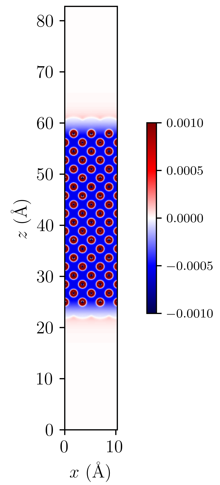

=======================================================================================================
Tutorial 11: Electrified electrode-electrolyte interfaces under potentiostatic control
=======================================================================================================

:Author:  Brad Ayers, Arihant Bhandari
:Date:    August 2023

.. role:: raw-latex(raw)
   :format: latex

Introduction
============

This tutorial endeavours to provide a comprehensive and illustrative example, highlighting ONETEP's ability to conduct potentiostatic calculations through the utilisation of a grand canonical DFT algorithm [Bhandari2021]_.
Alongside this written tutorial we have provided a Jupyter notebook that will guide you through the process of setting up and analysing a potentiostatic calculation.

Moreover, this tutorial will demonstrate the feasibility of conducting these calculations within a solvent and electrolyte medium, employing the Fisicaro soft-sphere continuum model [Fisicaro2017]_ 
for solvation and the neutralisation via the grand canonical electrolyte (NECS) model [Bhandari2020]_.

Setting up the calculations
===========================

We will begin this tutorial by creating lithium surfaces using a tool of your preference.
For the purpose of illustration, we have employed the ASE [Larsen2017]_ to generate a 10-layer BCC [100] lithium surface.
This can be simply visualised within the provided Jupyter notebook, and will look as follows:

.. figure:: _static/tutorial_11/Li90.png
   :align: center
   :width: 300%                

Notably, in this tutorial, we've chosen a (3x3x10) supercell with a 50 Å vacuum in total,
a decision that allows us to employ 9 Bohr NGWF radii, whilst ensuring ample volume for sufficient electrolyte to neutralise our surface.

Input files
-----------
For the purposes of this tutorial ONETEP will require only two files to work:

1. A .dat file, which contains all the information about your system (Atomic positions & Lattice vectors), as well your simulation parameters.
2. A Pseudopotential file, here we will employ the Norm-conserving on the fly generated CASTEP ones, but this is up to the users discretion.

**Both of the aforementioned files, as well as a few output files can be downloaded below:**

- :download:`Li.out <_static/tutorial_11/Li.out>`
- :download:`outputs.zip <_static/tutorial_11/outputs.zip>`
- :download:`Keywords.dat </_static/tutorial_11/keywords.dat>`
- :download:`Li_surface.dat <_static/tutorial_11/Li_surface.dat>`
- :download:`T11_workbook.ipynb </_static/tutorial_11/T11_workbook.ipynb>`
- :download:`Li_NCP19_PBE_OTF.usp <_static/tutorial_11/Li_NCP19_PBE_OTF.usp>`

Note that the output files required for the visualisation section of this tutorial are within the outputs.zip file, and will need to be extracted to the same directory as the Jupyter notebook.
Furthermore, Li_surface.dat is the .dat file used for job submission, and Keywords.dat contains the keywords that are taken in by the ASE script to generate the Li_surface.dat file.

The Dat file 
------------

**grand canonical Parameters**

Upon opening the provided Li.dat file, you will encounter the standard parameters that ONETEP users are already familiar with: ``Task``, ``Cutoff_energy``, ``Lattice_cart``, and ``Positions_frac``. 

However, after these, a new section of interest awaits, aptly named:

.. code-block:: none

   grand canonical Parameters
   ~~~~~~~~~~~~~~~~~~~~~~~~~

   edft_grand_canonical T             
   edft_reference_potential -1.20 eV  
   edft_electrode_potential  0.20  V  

Within the grand canonical formalism in ONETEP, there are two  main parameters of interest:

1. **Chemical Potential of the Reference Electrode**
   
   Represented as :math:`\mu_{\mathrm{e}}^{\mathrm{ref}}`, this value (-1.20 eV in this example) corresponds to the reference electrode's chemical potential. It serves as the benchmark against which all applied potentials are measured.

2. **Applied Potential to the Working Electrode**
   
   In this case, a potential of 0.20 volts (:math:`U`) is applied to the working electrode, giving us a working electrode potential of -1.40 eV (:math:`\mu_{\mathrm{e}}`).

These parameters find application in the following equations:

- **Chemical Potential of the Working Electrode** (:math:`\mu_{\mathrm{e}}`):
   
   .. math::

      \mu_{\mathrm{e}} = \mu_{\mathrm{e}}^{\mathrm{ref}} - e \cdot U

- **Number of Electrons** (:math:`N_e`):
   
   .. math::

      N_e = \sum_i f_i = \sum_i \frac{1}{1 + \exp{\left(\beta(\epsilon_i - \mu_e)\right)}}

- **Charge on the System** (:math:`q`):

   .. math::

      q = Z_{\mathrm{ion}} - e \cdot N_{e}

Hence, by defining the applied potential and reference electrode potential, we can establish the chemical potential of the working electrode.
It is worth noting here that only with zero applied potential (:math:`U = 0`) and the reference value set to the potential of zero charge
(:math:`\mu_{\mathrm{e}}^{\mathrm{ref}} = \mu_{\mathrm{e}}^{\mathrm{PZC}}`) will we get zero charge on the system (:math:`q = 0`).

As a result, we gain the ability to compute the number of electrons within our system using the Fermi-Dirac distribution. Where, :math:`\epsilon`  corresponds to the eigenvalues of the KS-equations, and :math:`\mu_{\mathrm{e}}`  is the chemical potential of our working electrode.
Thereby allowing us to accurately calculate the charge present in the quantum system for a given applied potential.

For a more detailed explanation of the grand canonical formalism, please refer to [Bhandari2021]_.

**Solvation Parameters**

This section will highlight some of the more unintuitive parameters that are required to conduct a solvated calculation.
They will be presented in the order in which they appear in the data file as done for the grand canonical parameters above.

This block will highlight the solvation parameters themselves, with the following block highlighting the solvent parameters

.. code-block:: none

   is_include_apolar T                 # Enables solvent-accessible surface-area (SASA) approximation
   is_smeared_ion_rep T                # Enables the smeared ion representation due to multigrid solver
   is_implicit_solvent T               # Enables the solvation model
   is_solvation_properties T           # Provides extra properties i.e. electrolyte concentration
   is_dielectric_function soft_sphere  # Utilising the Fisicaro soft-sphere model

For a much more detailed overview of each key parameter and its function, please refer to the documentation here: `Solvent and Electrolyte model <https://docs.onetep.org/implicit_solvation_v3.html>`_ 

For the solvent itself we have the following parameters:

.. code-block:: none

   is_bulk_permittivity 90.7           # permitivity value of our solvent        (ethylene carbonate in this case)          
   is_solvent_surf_tension 0.0506 N/m  # Surface tension of the selected solvent (ethylene carbonate in this case)      

Obviously these values will vary depending on the solvent of choice, and can be found in the literature.

**Electrolyte Parameters**

.. code-block:: none

   is_pbe                 full        # Enables the poison-boltzmann solver for electrolyte calculations
   is_pbe_bc_debye_screening T        # Enables the Debye screening boundary condition
   is_pbe_temperature   298.15        # Sets the temperature of the Boltzmann ions 
   is_pbe_neutralisation_scheme counterions_auto

The above parameters are required to conduct electrolyte calculations, and are fairly self-explanatory.
However, it is worth noting that there are several neutralisation schemes available, and the one chosen here is recommended for most cases.

Additionally, the following parameters are required by DL_MG to conduct the multigrid calculations:

.. code-block:: none

   mg_max_res_ratio 1000.0
   mg_max_iters_vcycle 500
   mg_max_iters_newton 300
   mg_vcyc_smoother_iter_pre 4
   mg_vcyc_smoother_iter_post 4

These parameters are fairly ubiquitous, and are not expected to change between calculations. For further information, please refer to the documentation here: `DL_MG <https://docs.onetep.org/implicit_solvation_v3.html#fine-control-over-dl-mg>`_

lastly, we have the following ions block, that define our electrolytes and their concentrations:

.. code-block:: none

   %BLOCK SOL_IONS
   Li    +1 1.0 # all concentrations are in Molar
   PF6   -1 1.0
   %ENDBLOCK SOL_IONS

Note that additional blocks can be added here to further adapt the model such as defining the soft-sphere radii of your system. 

Analysis
--------

Now that we have established the parameters required to conduct a solvated calculation, we can proceed to analyse the results obtained from either your own calculations or the provided ones.

The first file of interest is the ``Li.out`` file, which contains the usual ONETEP output you might be familiar with, but will include additional that are of interest to us. 
Firstly within CG-DFT inner loop, we can find the following:

.. code-block:: none

   Iter                              Commutator    Grand pot.(L=E-TS-muN)  DeltaL
     # 2                          0.000001192422   -1269.59513707094357  -2.05E-12

   Step                       =       0.000010819110
   Energy (E)                 =   -1297.517766665092
   Entropy (-TS)              =      -0.065437957621
   Chemical potential (-muN)  =      27.988067551769
   Grand potential(L=E-TS-muN)=   -1269.595137070944
   Est. 0K Energy 0.5*(E+L)   =   -1283.556451868018
   Charge on quantum system   =      -3.995764707545
   Residual Non-orthogonality =      -0.000000000000

If users are familiar with the canonical inner loop printing this will look familiar, however, there are a few key differences:

- **Grand Potential** (:math:`L=E-TS-\mu_{\mathrm{e}}N`):
   
   This is the grand potential of the system, and is the quantity that is minimised in the grand canonical formalism,
   rather than the Helmholtz free energy as in the canonical formalism.

- **Chemical Potential of the Working Electrode** (:math:`-\mu_{\mathrm{e}}N`):
   
   This is the chemical potential of the working electrode, and is the quantity that is constant in the grand canonical formalism,
   in direct contrast to the canonical formalism, where the number of electrons is constant.

- **Charge on the System** (:math:`q`): 
      
      This is the charge on the quantum system and is an important value to consider when analysing the results of a potentiostatic calculation, as surface chemistry is dependent on the charge of one's system.

Another crucial section of the ``Li.out`` file is the bulk concentration of the electrolyte species, which can be found in the following section:

.. code-block:: none

    +--------------------------- Chemical potential --------------------------+
    |   # | Name | Bulk conc. |    mu_ideal   |   mu_excess   |    mu_total   |
    |-------------------------------------------------------------------------|
    |   1 |   Li |  2.1511516 |   0.000723249 |  -0.000320109 |   0.000403139 |
    |   2 |  PF6 |  0.7473276 |  -0.000274995 |  -0.000128144 |  -0.000403139 |
    |-------------------------------------------------------------------------|

    +----------------- Boltzmann ion concentration and charge -----------------+
    |   # | Name | Bulk conc. | Average conc. | Neutr. ratio |    Total charge |
    |--------------------------------------------------------------------------|
    |   1 |   Li |  2.1511516 |   2.151153746 |     0.820011 |     6.122921628 | 
    |   2 |  PF6 |  0.7473276 |   0.747327832 |     0.179989 |    -2.127151420 | 
    +--------------------------------------------------------------------------+
                                                        total:     3.995770208*

This tells the user the bulk concentration of each species required to neutralise the surface.
Note however as this is a grand canonical neutralisation we can have average concentrations greater than 1M.
This is due to grand canonical neutralisation alowing for a changing number of species in the system, ensuring that the surface is neutralised at all times.

A final note here is as our calculations are performed within in solvent & electrolyte additional energy components are added to the energy breakdown printed at the end our calculations:

.. code-block:: none

   ---------------- ENERGY COMPONENTS (Eh) ----------------
   | Kinetic                    :      937.59573135429741 |
   | Pseudo. (local,PBC,corr'd) :     -443.84297910438869 |
   | Pseudopotential (non-local):     -714.75069598392804 |
   | Hartree (molecular)        :       41.93332431044017 |
   | Exchange-correlation       :     -300.25087260634427 |
   | Ewald                      :    20583.02565243620480 |
   | Dispersion Correction      :       -0.65678636433385 |
   | Smeared ion non-self corr. :   -20592.71568368581570 | 
   | Smeared ion self corr.     :     -807.85811781290136 |
   | Solvent cavitation energy  :        0.02783765502215 |
   | Solute-solvent dis-rep en. :       -0.02001318613680 |
   | Elect. mobile ion energy   :       -0.00262591694826 |
   | Osmotic pressure energy    :       -0.00778959415557 |
   | Acc. corr. (steric) energy :        0.00044786192622 |
   | Ionic atmo. rearrang. en.  :        0.00641482442191 |
   | Chemical pot. contribution :       -0.00161085245160 |
   | Total                      :    -1297.51776666508886 |
   |------------------------------------------------------|
   | Entropic contribution      :       27.92262959414529 |
   | Total free energy          :    -1269.59513707094357 |
   --------------------------------------------------------
   ------ LOCAL ENERGY COMPONENTS FROM MATRIX TRACES ------
   | Pseudopotential (local)    :     -443.84297910438886 |
   | Hartree                    :      -24.92214858378443 |
   --------------------------------------------------------
   |Integrated density          :      543.99576470754505 |
   |Integrated spin density     :        0.00000000000165 |
   |Integrated |spin density|   :        0.00000001531685 | 
   |Local density approx. <S^2> :        0.00000000765765 |
   |Integrated density tr(KS)   :      543.99576470754528 |
   |Integrated spin tr(KS)      :        0.00000000000153 |
   --------------------------------------------------------

We won't delve into the details of each energy component here, but it is worth noting that the solvent and electrolyte contributions are present in the energy breakdown.
For a more detailed explanation of each energy component, please refer to [Bhandari2021]_.

**visualisation**

Whilst a majority of the analysis can be conducted using the ``Li.out`` file, there are a few visualisations that can be conducted using the provided ``Li_out_bion_conc_species_1.dx`` and ``Li_out_bion_conc_species_2.dx`` files. 
Such as plotting the xy-averaged concentration profiles of the electrolyte species, it is worth stating that all code used to generate these plots can be found in the provided Jupyter notebook.

.. figure:: _static/tutorial_11/average_concentration_plot.png
   :align: center
   :width: 75%

Looking at the figure above we can see that the concentration of the lithium electrolyte species is highest (12M) at the surface of the electrode, and decreases as we move away from the surface, forming a double layer along our surface.
In contrary we can observe the PF6 electrolyte species has a concentration approaching 0M at the surface, and increases as we move away from the surface, note that these are local concentrations and not bulk concentrations.

We can also visualise the densities of our lithium slab and the electrolyte species to illusrate this double layer effect by adding the ``Li_out_bion_density_total.dx`` and ``Li_in_rho.dx`` files together and running the provided code:

Here we can see that there is a positive charge denisty (our lithium ions) at the surface of the electrode, that diffuses in intensity as we move away from the surface.

Where to go next?
=================

This tutorial has provided a brief overview of the grand canonical formalism, and how it can be employed to conduct potentiostatic calculations, 
as well as highlighting a few key visualisation techniques that can be conducted on the output files.

However, there are a few key areas that have not been covered in this tutorial that the reader should explore, such as:

1. **Defining their reference potentials** (:math:`\mu_{\mathrm{e}}^{\mathrm{ref}}`):
   
   In this tutorial, we have defined the reference potential as -1.20 eV, however, this value is dependent on the reference electrode of choice, 
   and can be found in the literature or by calculating one's own reference potential using the method highlighted in [Bhandari2021]_.

2. **Cycling through potentials**:
   
   In this tutorial, we have only conducted a single potentiostatic calculation, however, it is possible to conduct a series of calculations at different potentials, 
   and calculate properties such as capacitance etc. 

References       
----------

.. [Bhandari2020]     Bhandari, A.; Anton, L.; Dziedzic, J.; Peng, C.; Kramer, D.; Skylaris, C.-K. Electronic Structure Calculations in Electrolyte Solutions: Methods for Neutralization of Extended Charged Interfaces. The Journal of Chemical Physics 2020, 153 (12), 124101. https://doi.org/10.1063/5.0021210.
.. [Fisicaro2017]  Fisicaro, G.; Genovese, L.; Andreussi, O.; Mandal, S.; Nair, N. N.; Marzari, N.; Goedecker, S. Soft-Sphere Continuum Solvation in Electronic-Structure Calculations. Journal of Chemical Theory and Computation 2017, 13 (8), 3829–3845. https://doi.org/10.1021/acs.jctc.7b00375.
.. [Larsen2017]    Hjorth Larsen, A.; Jørgen Mortensen, J.; Blomqvist, J.; Castelli, I. E.; Christensen, R.; Dułak, M.; Friis, J.; Groves, M. N.; Hammer, B.; Hargus, C.; Hermes, E. D.; Jennings, P. C.; Bjerre Jensen, P.; Kermode, J.; Kitchin, J. R.; Leonhard Kolsbjerg, E.; Kubal, J.; Kaasbjerg, K.; Lysgaard, S.; Bergmann Maronsson, J. The Atomic Simulation Environment—a Python Library for Working with Atoms. Journal of Physics: Condensed Matter 2017, 29 (27), 273002. https://doi.org/10.1088/1361-648x/aa680e.
.. [Bhandari2021]  Bhandari, A.; Peng, C.; Dziedzic, J.; Anton, L.; Owen, J. R.; Kramer, D.; Chris-Kriton Skylaris. Electrochemistry from First-Principles in the grand canonical Ensemble. Journal of Chemical Physics 2021, 155 (2). https://doi.org/10.1063/5.0056514.
