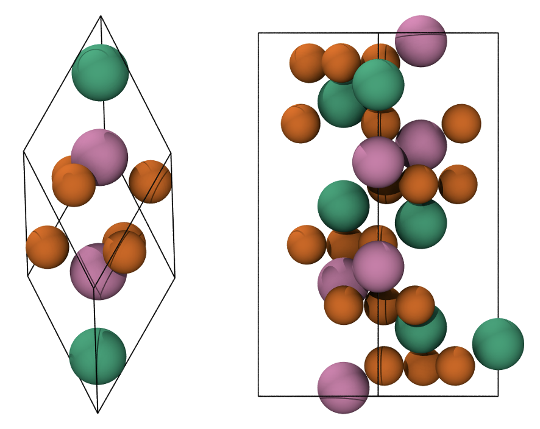
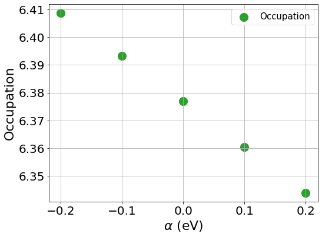
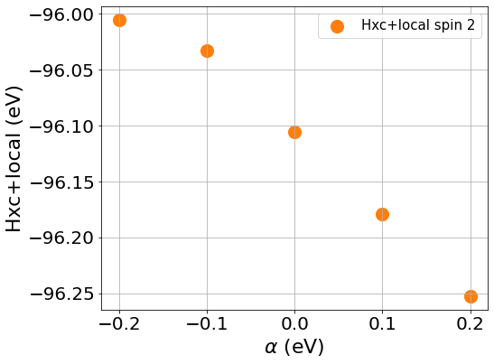
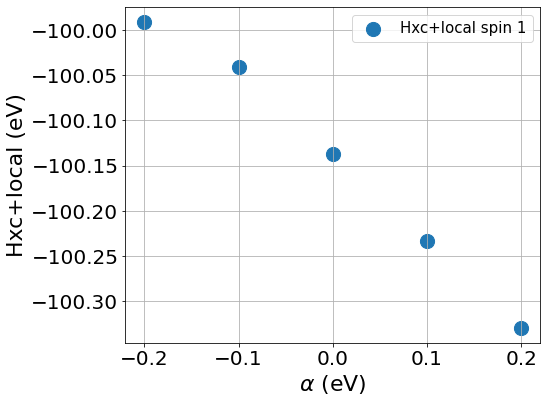

=================================================================================================================
Tutorial 15: First principles calculation of :math:`U` and :math:`J`
=================================================================================================================

:Author: Davide Sarpa
:Date:   Aug 2024

.. role:: raw-latex(raw)
   :format: latex

Introduction
============

The goal of the tutorial is to provide a working example on how it is possible to compute the :math:`U` and :math:`J` parameters from first principles.
We will work on Hematite :code:`+-\-+` antiferromagnetic configuration as you should already be familiar with it, if not refer to tutorial 9.

The reason behind computing the parameters via first principles is because they directly correct the spurious self-interaction error and hence the physics of the system, while choosing and empirical :math:`U` and :math:`J` might
give a better description of a specific property of the material, it does not guarantee that the self-interaction is fully corrected. 

.. _Figure fig:T15_1:

   Primitive rhombohedral cell (left), conventional hexagonal cell (right). Fe atoms with spin up and down are in green and pink, respectively. O atoms are in orange.

Theoretical background
-----------------------

The basic idea is to compare the response of the system to a perturbation in the DFT and in the DFT+\ :math:`U` frameworks.
We start by defining the response function :math:`\chi`, which describes how the occupation of localised orbitals changes with respect to a shift in the potential acting on these orbitals:
The linear response method determines the Hubbard :math:`U` parameter by comparing the response of the system to a perturbation in standard DFT and DFT+\ :math:`U` frameworks.

We define the response function :math:`\chi` as: 

.. math::
   
   \chi = \frac{dn^{I\sigma}}{d\alpha}

where :math:`n` is the occupation matrix of the localised orbitals and :math:`\alpha` is a potential shift applied to these orbitals.

We compute two response functions:

- :math:`\chi_0`: the bare Kohn-Sham (KS) response (without :math:`U`)
- :math:`\chi`: the interacting response (with :math:`U`)

These are related by:

.. math::
   
   U = \chi^{-1} - \chi_0^{-1}

which allow us to compute :math:`U`. 

The perturbation is applied by shifting the potential of the localised orbitals:

.. math::

   V_{\text{ext}}^{p} = V_{\text{ext}} + \alpha \sum_{m,m'}\lvert\varphi_{m'}^{(I)}\rangle\langle\varphi_m^{(I)}\rvert

We then iterate until self-consistency is achieved. 

This is the conventional linear response and its done in a supercell as the perturbation should not interact with its periodic images.
Another approach to compute :math:`U` and :math:`J` is known as minimum tracking method [Linscott2018]_.

Minimum Tracking Method
-----------------------
The minimum tracking method is based on a reformulation of the response matrices
based on the ground state density of the perturbed
system. We can identify the interacting and noninteracting
response matrices as:

.. math::

   \chi_{IJ} = \frac{dn^I}{dv_\text{ext}^J},

.. math::

   (\chi_0)_{IJ} = \left[\frac{dn}{dv_\text{KS}}\left(\frac{dv_\text{KS}}{dv_\text{ext}}\right)^{-1}\right]_{IJ}

This allows us to work around the practical issues from the conventional linear response.
This approach can also be extended to include the :math:`J` exchange term (The response matrices now become rank-four tensors [Linscott2018]_). 
In practice this is done by modifying the perturbation by including an additional term (spin-splitting):

.. math::

   V_{\text{ext}}^{p} = V_{\text{ext}} + \beta \sum_{m,m'}\lvert\varphi_{m'}^{(I\uparrow)}\rangle\langle\varphi_m^{(I\uparrow)}\rvert-\lvert\varphi_{m'}^{(I\downarrow)}\rangle\langle\varphi_m^{(I\downarrow)}\rvert

Setting up the calculations
===========================

We will configure a set (9 total) of bulk hematite single point calculations to compute :math:`U` and :math:`J`  for the Fe :math:`3d` orbitals. We apply distinct labels to Fe atoms, 
enabling us to assign different parameters to spin-up and spin-down Fe atoms.
We will be using a 4x4x1 supercell generated from the conventional cell.

Tutorial files
--------------

All the files needed for the simulations can be downloaded from

- :download:`Fe_NCP19_PBE_OTF.usp <_static/tutorial_9/Fe_NCP19_PBE_OTF.usp>`, 
- :download:`O_NCP19_PBE_OTF.usp <_static/tutorial_9/O_NCP19_PBE_OTF.usp>`,
- :download:`hematite.out <_static/tutorial_15/output.zip>`,
- :download:`hematite.dat <_static/tutorial_15/hematiteN.Ueq0-1250.dat>`.

Practical calculation
---------------------
The step by step approach to compute :math:`U` and  :math:`J` is:
   
   1. add :code:`hubbard_calculating_u : T` in the input file,
   
   2. choose an atom for the atom type we want to compute :math:`U` or :math:`J` and label it differently. In our case you can see from the input file that we have labelled this single atom Fe1U. It does not matter whether we choose a spin up or spin down atom for an AFM material.
   
   3. apply the perturbation to this atom only and perform single points calculations,
   
   4. Compute U and J with the following formulas:

.. math::
   U = \frac{1}{2} \frac{\delta v^\uparrow_{Hxc} + \delta v^\downarrow_{Hxc}}{\delta(n^\uparrow + n^\downarrow)}

.. math::
   J = -\frac{1}{2} \frac{\delta v^\uparrow_{Hxc+local} - \delta v^\downarrow_{Hxc+local}}{\delta(n^\uparrow - n^\downarrow)}

where :math:`\delta v^\uparrow_{Hxc}` and :math:`\delta v^\downarrow_{Hxc}` represent the derivative of the Hxc+local potential with respect to the applied potential
(either :math:`\alpha` to compute :math:`U` or :math:`\beta` to compute :math:`J`)
and  :math:`\delta(n^\uparrow + n^\downarrow)` and :math:`\delta(n^\uparrow - n^\downarrow)` represent the derivative of the total occupation :math:`n^\uparrow + n^\downarrow` with respect to :math:`\alpha` and of :math:`n^\uparrow - n^\downarrow` 
with respect to :math:`\beta`

How and where to apply the perturbation
----------------------------------------

Looking at the input file provided you can see we activated the :code:`hubbard_calculating_u` functionality and in the Hubbard block we have

.. code-block:: none

   %BLOCK HUBBARD
   Fe1  2 0.0 0.0 -10.0 0.00 0.0
   Fe1U 2 0.0 0.0 -10.0 0.00 0.0
   Fe2  2 0.0 0.0 -10.0 0.00 0.0
   %ENDBLOCK HUBBARD

where the columns of the ``hubbard`` block are described as follows:

1. **Species Label**

   The species to apply the DFT+\ :math:`U` correction to.

2. **Angular Momentum:** :math:`l`

   The angular momentum of the projectors which the Hubbard correction is applied to.
   In this example :math:`l=2` which corresponds to d-orbitals
   
3. **Hubbard** :math:`U` **value**
   
   The value of the Hubbard :math:`U` for this sub-shell, in
   electron-volts. We are computing it so we can choose 0 as its value
   
4. **Hund's exchange** :math:`J` **value**
   
   The value of the Hund’s exchange :math:`J` for this sub-shell, in
   electron-volts. We are computing it so we can choose 0 as its value

5. **Effective Charge** :math:`\mathbf{Z}` **and Projectors type**
   The default projectors are NGWFs
   
6. **The** :math:`\alpha` **prefactor**
   
   The perturbation term needed to compute :math:`U` 

7. **The spin-splitting factor :math:`\beta`**
   
   The perturbation term needed to compute :math:`J`

To compute  :math:`U` you need to change the :math:`\alpha` value while keeping :math:`\beta` equal to 0.
To compute  :math:`J` you need to change the :math:`\beta` value while keeping :math:`\alpha` equal to 0.

We have provided you only 1 input file the one corresponding to 0 for both  :math:`\alpha` and :math:`\alpha`
you need to generate the remaining 8 file.

The :math:`\alpha` and :math:`\beta` values you need to use for the U calculation are = -0.2, -0.1, 0.0, 0.1, 0.2.

Why these values?
We want to apply a big enough perturbation to see an effect and to be able to compute derivatives but also remain in the linear regime. It is not necessary to use 5 datapoints
to obtain a good value but it's highly recommended. 

Evaluating the outputs
======================

In order to compute :math:`U` and :math:`J` we need the values of the :math:`v^\uparrow_{Hxc}` and :math:`v^\downarrow_{Hxc}` which can be found
in the following block:

.. code-block:: none

   ################################################################################
   DFT+U information on Hubbard site     72 of species Fe1U and spin      1
   The average Hxc+local potential is           -100.04043423 eV.
   The average Hubbard potential is               -0.10000000 eV.
   ################################################################################
   DFT+U information on Hubbard site     72 of species Fe1U and spin      2
   The average Hxc+local potential is            -96.03296381 eV.
   The average Hubbard potential is               -0.10000000 eV.
   ################################################################################

note that we are looking only at the values for Fe1U atom which is the only atom we have applied the perturbation to. There are multiple instances of this block and we are only
interested in the last one. 

Next we need to look at occupation of the Hubbard manifold :math:`n^\uparrow + n^\downarrow` and :math:`n^\uparrow - n^\downarrow` which can be found in the following block:

.. code-block:: none

   ################################################################################
   DFT+U information on atom      1 of Hubbard species Fe1U
   ################################################################################
   Occupancy matrix of Hubbard site     72 and spin      1 is 
   m_l =   -2          -1           0           1           2
   0.98583311  0.01105739  0.00017283  0.00149346 -0.00039754
   0.01106973  0.98239066 -0.00021203  0.00037893  0.00244851
   0.00017266 -0.00021405  0.99296562  0.00030517  0.00069962
   0.00149451  0.00037878  0.00029134  0.98210951 -0.01203475
   -0.00039830  0.00244943  0.00069122 -0.01204334  0.98340592
   WARNING: DFT+U ENERGY of Hubbard site     72 and spin      1 is negative.
   ################################################################################
   Occupancy matrix of Hubbard site     72 and spin      2 is 
   m_l =   -2          -1           0           1           2
   0.32009924 -0.06393836 -0.00012245 -0.01033413 -0.00070413
   -0.06400973  0.33409081 -0.00029354  0.00034179 -0.01142806
   -0.00012106 -0.00027777  0.19025018 -0.00114325  0.00745246
   -0.01034138  0.00034159 -0.00106271  0.33014982  0.06774687
   -0.00070499 -0.01143070  0.00762074  0.06779446  0.29199808
   WARNING: DFT+U ENERGY of Hubbard site     72 and spin      2 is negative.
   ################################################################################
   Total occupancy of Hubbard site     72 is         6.39329292 e
   Local magnetic moment of Hubbard site     72 is   3.46011669 mu_B
   DFT+U energy of Hubbard site     72 is           -0.02349492 Ha
   ################################################################################

the total occupancy of Hubbard site is the :math:`n^\uparrow + n^\downarrow`, while local magnetic moment of Hubbard site is the :math:`n^\uparrow - n^\downarrow`. 
We now have all the data we need to compute :math:`U` and :math:`J`

Step by step to compute :math:`U` :
 - Calculate the slope of :math:`v^\uparrow_{Hxc}` and :math:`v^\downarrow_{Hxc}` with respect to :math:`\alpha`, these are the :math:`\delta v^\uparrow_{Hxc}` and :math:`\delta v^\downarrow_{Hxc}` that appear in the formula to compute :math:`U`
 - Calculate the slope of the :math:`n^\uparrow + n^\downarrow` with respect to :math:`\alpha` this is the denominator appearing in the formula to compute :math:`U`
 - Compute :math:`U` using the formula provided above.

To compute :math:`J` follow similar procedure but the derivatives are with respect to :math:`\beta`.

**IMPORTANT: The actual** :math:`\beta` **values in the calculations are half of the one specified in the input file.**

To compute the slope we first plot the Hxc+local for spin 1 and spin 2 as well as the occupation number against the values of :math:`\beta`, the same should be done with values of beta to compute  :math:`J`

|U_hxc_1| |U_hxc_2| 

You can see from the plots that while the changes of the occupation numbers are perfectly linear at all :math:`\alpha` values, this is not the case for the Hxc+local potential where a degree of non-linearity
is present at a value of :math:`\alpha=0` this is VERY important as if we were to include this data point in our calculation of :math:`U`, we would retrieve a wrong value as our perturbation goes beyond the linear response regime.

If you discard the non-linear data point, you should obtain the following values. 

- :math:`U` = 5.158 eV
- :math:`J` = 0.604 eV 

What to do next
---------------
The tutorial is now complete, but you could still move forward. What can you do next?

- Compute :math:`U` for oxygen p states as this is commonly done in transition metal oxides, it's usually large. For more information [Moore2024]_

.. [Linscott2018] \ E.B. Linscott, D. J. Cole, M. C. Payne, D. D. O'Regan, Phys. Rev. B **98**, 235157 (2018). https://doi.org/10.1103/PhysRevB.98.235157
.. [Moore2024] \ G. C. Moore, M. K. Horton, E. Linscott, A. M. Ganose, Ma. Siron, D. D. O'Regan, K. A. Persson Phys. Rev. Materials **8**, 014409 (2024). https://doi.org/10.1103/PhysRevMaterials.8.014409
