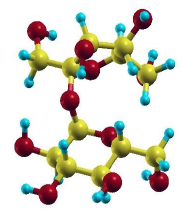
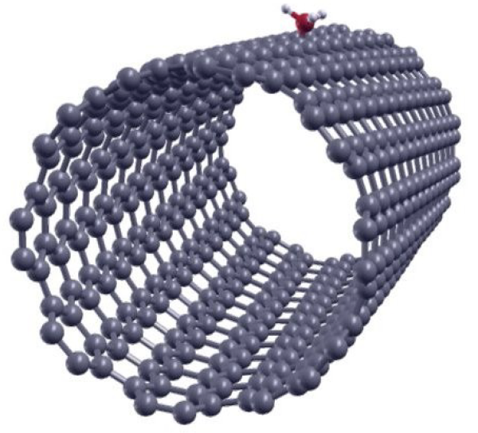

================================================================================
Tutorial 4: Geometry optimization
================================================================================

:Author: Simon M.-M. Dubois
:Date:   June 2021 (revised Aug 2023)

.. role:: raw-latex(raw)
   :format: latex
..

Introduction
============

This tutorial aims at showing how to run a simple geometry optimization with
ONETEP.

Geometry optimization is one of the primary tasks in quantum simulation.
The essence of the calculation is for the constituting atoms to be moved to the
positions where the total energy is minimal. In general, this can be tackled
efficiently if the forces on the atoms can be computed.
Over the past twenty years, various schemes have been derived to solve this
problem in the framework of ab initio calculations. These range from simple
approaches based on molecular dynamics, such as the steepest descent and damped
dynamics methods, to the more sophisticated conjugated gradient and Quasi-Newton
methods.

The geometry optimization scheme implemented in ONETEP relies on the isolation
of the atomic and electronic subsystems
(i.e. the Born-Oppenheimer approximation). For a given configuration of the
ionic positions, the electronic degrees of freedom are completely relaxed so
that the electronic subsystem stays on the Born-Oppenheimer surface. All the
possible configurations of the ionic positions therefore define a
multi-dimensional potential energy surface for which we want to find the
global minimum. The atomic forces are calculated by application of the
Hellmann-Feynman theorem and the ionic positions are moved around by means of
the Broyden-Fletcher-Goldfarb-Shanno (BFGS) method in order to find the minimum
of the potential energy. At this point, one has to keep in mind that several
local minima may be present in the configuration space and the algorithm can
get trapped in one of those. Therefore, despite the sophistication of the
minimization method, the location of a global minimum still requires the
intuition of a good starting point.

The calculation flow of a geometry optimization in ONETEP is a three
step process:

- Given an ionic configuration, the electronic degrees of freedom are relaxed
  (cfr. self-consistent optimization of the density kernel and NGWFs).

- The total energy and atomic forces are computed and compared with those of
  previous ionic configurations. The threshold chosen as stopping criterion for
  the geometry optimization is tested.

- The atomic position are updated by means of the BFGS algorithm.

The Ethene Molecule
-------------------

As a first example, we will deal with the geometry optimization run a geometry
optimization of the ethene molecule. To do this, we need to set:

::

    task : GeometryOptimization

For the SCF part, try running a calculation with an energy cutoff of about 650
eV, NGWF radii of about 6.0 Bohr and a cubic simulation cell of side-length 40
Bohr:

::

    cutoff_energy          : 650.0 eV
    output_detail : VERBOSE

    %block species
    H  H  1  1  6.75
    C  C  6  4  6.75
    %endblock species

    %block lattice_cart
    Ang
    20.0 0.0 0.0
    0.0 20.0 0.0
    0.0 0.0 20.0
    %endblock lattice_cart

    %block positions_abs
    Ang
    C  5.0000000000000000  5.9228319999999997  6.9051750000000007
    C  5.0000000000000000  5.9228319999999997  5.5702150000000001
    H  5.0000000000000000  6.8456639999999993  7.4753900000000009
    H  5.0000000000000000  5.0000000000000000  7.4753900000000009
    H  5.0000000000000000  6.8456639999999993  5.0000000000000000
    H  5.0000000000000000  5.0000000000000000  5.0000000000000000
    %endblock positions_abs

You will also need the pseudopotential block:

::

    %block species_pot
    H   hydrogen.recpot
    C   carbon.recpot
    %endblock species_pot

A full example input/output file can be found
:download:`ethene.tar.gz <_static/tutorial_4/ethene.tar.gz>`.

Now you are ready to run ONTEP:
::

    mpirun -n 2 onetep ethene.dat | tee ethene.out

The calculation should take ~15 min on 2 MPI processes (on a 
Intel Xeon Silver 4114 cpu). In the meantime you may want to
repeat the procedure with varying parameters in order to converge the
calculation with respect to the cutoff energy, the NGWF radii, as well as the
size of the simulation cell. Besides, if you aim to compute a properties
(e.g. the C-C bond length) with a given computational accuracy (e.g. 0.005 Ang),
you should also check that the :code:`geom_max_iter` and
:code:`ngwf_treshold_orig` parameters do not prevent to reach the desired
accuracy.

The output of ONETEP consists principally of two files: :code:`ethene.out`
(the main output file) and :code:`ethene.geom`.
This latter contains one block of information for each
iteration of the geometry optimization. Each block looks like:

::

                               4
                -1.37265351E+001     -1.37265351E+001                       <-- E
                 3.77945227E+001      0.00000000E+000      0.00000000E+000  <-- h
                 0.00000000E+000      3.77945227E+001      0.00000000E+000  <-- h
                 0.00000000E+000      0.00000000E+000      3.77945227E+001  <-- h
    C     1      9.44793440E+000      1.11928879E+001      1.30335653E+001  <-- R
    C     1      9.44790699E+000      1.11928871E+001      1.05404458E+001  <-- R
    H     1      9.44899454E+000      1.29429511E+001      1.41255628E+001  <-- R
    H     1      9.44900396E+000      9.44173342E+000      1.41253623E+001  <-- R
    H     1      9.44897328E+000      1.29435030E+001      9.45003514E+000  <-- R
    H     1      9.44897086E+000      9.44121996E+000      9.45024026E+000  <-- R
    C     1     -1.75749466E-005     -2.60718796E-004     -3.74725290E-004  <-- F
    C     1     -1.20705498E-005     -2.14434259E-004      2.65511453E-004  <-- F
    H     1      1.13344672E-005      2.37875189E-004      1.82501034E-005  <-- F
    H     1      9.56687732E-006      1.39393204E-005     -1.03600237E-004  <-- F
    H     1      4.64762662E-006      1.58612511E-004      4.33446848E-005  <-- F
    H     1      4.09652530E-006      6.47260346E-005      1.51219285E-004  <-- F

where all values are in Hartree atomic units and

- The first line is the iteration number.
- The second line is the total energy.
- The next three lines are the lattice vectors expressed in Caresian coordinates.
- The next N lines (where N is the number of atoms) give the atomic coordinates.
- The following N lines give the atomic forces.

The main informations regarding the geometry optimization are gathered in the
:code:`ethene.geom` file, however you may want to visualize the results in a
glimpse. You can use the perl script
:download:`geom2xyz <_static/tutorial_4/geom2xyz>` to generate a :code:`.xyz`
file containing the atomic coordinates at each iteration of the geometry
optimization:

::

    chmod 700 geom2xyz
    geom2xyz ethene.geom

This should produce a file :code:`ethene.xyz` that you can visualize with your
favourite package (e.g. XCrysDEN). 
Though the film of the relaxation provides you with crucial information such as
the appearance of dissociation, symmetry breaking, etc. 
It is a good practice to keep track of the energy and forces at each iteration 
in order to assess the relaxation process. The :code:`-- E` tag which labels the 
total energies in the :code:`ethene.geom` file may be used for that purpose. 
Create a new file :code:`ethene_energy.dat` and plot the evolution of the 
total energy using:

::

    $ grep ' E' ethene.geom | awk '{print $1}' > ethene_energy.dat
    $ gnuplot plot with lines 'ethene_energy.dat'

You should notice that the total energy of the system decreases monotonically.
Similarly, you can keep track of the maximum rms force on the ions at each
iteration by running:

::

    $ grep "<-- BFGS" ethene.out | grep "|F|max"

This should produce you something like:

::

    |  |F|max   |   2.038842E-002 |   2.000000E-003 |    Eh/Bohr | No  | <-- BFGS
    |  |F|max   |   3.567221E-003 |   2.000000E-003 |    Eh/Bohr | No  | <-- BFGS
    |  |F|max   |   5.188186E-003 |   2.000000E-003 |    Eh/Bohr | No  | <-- BFGS
    |  |F|max   |   1.375629E-003 |   2.000000E-003 |    Eh/Bohr | Yes | <-- BFGS
    |  |F|max   |   4.568394E-004 |   2.000000E-003 |    Eh/Bohr | Yes | <-- BFGS

The second column is the calculated value of the maximum rms force on the atoms,
the third column is the force threshold that the code is trying to achieve, the
fourth column provides the units, and the fifth column informs you as to whether
convergence of the force has been achieved or not. You may visualize this
information using gnuplot:

::

    $ grep "<-- BFGS" ethene.out | grep "|F|max" | awk '{print $4}' > ethene_force.dat
    $ gnuplot plot with lines 'ethene_force.dat'

You are now familiar with the geometry optimization scheme in ONETEP.
You might examine in more details the input variables that allow to control the
process. The keywords associated with the geometry optimization all start with
the :code:`geom_` prefix.
Their description is found on the `ONETEP Documentation <https://docs.onetep.org>`_. In particular, take a few minutes
to have a look at the variables: 

::

    geom_max_iter
    geom_convergence_win
    geom_disp_tol
    geom_energy_tol
    geom_force_tol

Though their default values may appear to be convenient in most circumstances,
these latter are the very basic input variables to master before launching a
geometry optimization. Here, it is important to note that the three tolerance
criteria (:code:`geom_disp_tol`, :code:`geom_energy_tol`, and
:code:`geom_force_tol`) are not exclusive.
The three criteria have to be satisfied in order for the optimization to stop.
You might have noticed that during the relaxation of ethene molecule, the
default threshold imposed on the atomic forces
(:code:`geom_force_tol : 0.02 Ha/Bohr`) has been reached before the one
associated with the convergence of the energy
(:code:`geom_energy_tol : 10e-06 Ha/Atom`).

Like all the quasi-Newton schemes, the BFGS algorithm accumulates information
about the Hessian matrix.
As the the number of iteration increases, BFGS improves its knowledge of
the the potential energy surface around the minimum and the matrix used
to build the quadratic model of the potential energy surface converges
towards the true Hessian matrix corresponding to the local minimum.
However, the Hessian matrix is poorly approximated during the first few
relaxation steps.
It is therefore important to properly initialize the BFGS scheme.
This may be conveniently done by means of a unique parameter
:code:`geom_frequency_est`.
For the best efficiency, its value should corresponds to a rough estimation of
the average of the optical phonon frequencies at the center of
the Brillouin zone.

In the case of the ethene molecule, the average of the experimentally reported
vibration frequencies is 0.0081 Hartree.
This value is very close to the default setting of :code:`geom_frequency_est`
and we do not expect any speed-up of the relaxation process by adjusting it.

In various circumstances, it may appears convenient to impose some
constraints to the atomic positions during the geometry optimization.
Note that in the case of molecular systems it is often a good idea to keep an
atom or an axis fixed during the optimization process in order to avoid losing
computational time due to the rotations and/or translations of the system.
Therefore it is worth having a quick look at the meaning of the variables:

::

    species
    species_constraints

Finally, it is worth noting that, when running a geometry optimization, ONETEP
produces a :code:`.continuation` file.
This latter contains all the information regarding the optimization
process and can be very helpful to restart an optimization from a previous run.
In such a case, the only thing you will need is to turn on the flag
:code:`geom_continuation`.
In the same line of thought, a appropriate use of the keywords that control the
reading/writting actions of the code, may help you to save some precious
computational time:

::

    write_converged_dkngwfs
    read_denskern
    read_tightbox_ngwfs

For example, to use :code:`write_converged_dkngwfs : T` is a good practice when running a molecular
optimization as it avoid you to lose time in writing the density kernels and NGWFs on the disk.

The Sucrose Molecule
--------------------

At this point, you should be familiar with most of the keywords needed to run a
proper geometry optimization.
Therefore, we suggest you to leave the ethene molecule and to try to optimize a
larger organic molecule.
You can find an example input file for the sucrose molecule
:download:`here <_static/tutorial_4/sucrose.dat>`.
You should edit and read it carefully.
You see that the :code:`write_converged_dkngwfs` flag has been activated.
In addition, the values of
:code:`ngwf_cg_max_step` and :code:`lnv_cg_max_step` have been increased in
order to allow unconstrained line search during the conjugate gradient
optimization of the density kernel and NGWFs respectively.

The calculation should take a bit more than an hour (with 16 MPI processes on a
Intel Xeon Silver 4114 CPU).
Keeping trace of the atomic forces, you should notice a rapid decrease of the
maximum rms force on the ions during the first relaxation steps.
However, the hydrogen atoms tend to wiggle quite a lot and it takes a some time
for the positions to settle down according to relaxation criteria.

::

    | |F|max | 1.212754E-002 | 2.000000E-003 | Ha/Bohr | No | <-- BFGS
    | |F|max | 1.407689E-002 | 2.000000E-003 | Ha/Bohr | No | <-- BFGS
    | |F|max | 1.253042E-002 | 2.000000E-003 | Ha/Bohr | No | <-- BFGS
    | |F|max | 4.859480E-003 | 2.000000E-003 | Ha/Bohr | No | <-- BFGS
    | |F|max | 1.052111E-002 | 2.000000E-003 | Ha/Bohr | No | <-- BFGS
    | |F|max | 5.953036E-003 | 2.000000E-003 | Ha/Bohr | No | <-- BFGS
    | |F|max | 6.344620E-003 | 2.000000E-003 | Ha/Bohr | No | <-- BFGS
    | |F|max | 6.587572E-003 | 2.000000E-003 | Ha/Bohr | No | <-- BFGS
    | |F|max | 5.241521E-003 | 2.000000E-003 | Ha/Bohr | No | <-- BFGS
    | |F|max | 5.455889E-003 | 2.000000E-003 | Ha/Bohr | No | <-- BFGS
    | |F|max | 3.623343E-003 | 2.000000E-003 | Ha/Bohr | No | <-- BFGS

.. _Figure fig:T4_1:

   Ball stick representation of the sucrose molecule.

Periodic Crystals
-----------------

Here above, the geometry optimization scheme has been illustrated by means of
two molecular systems. Obviously, the same scheme holds for periodic crystals.
As an example, we will investigate the adsorption of ammonia on a
(10,8) carbon nanotube.

The carbon nanotube considered here contains 488 carbon atoms in its unit-cell
and its chiral periodicity is of 62.87 Bohr.

.. _Figure fig:T4_2:

   Ball-stick representation of the ammonia adsorbed on a CNT (10,8)

Following the prescriptions stated above, you should be able to write an input
file for the nanotube (an example is given in
:download:`here <_static/tutorial_4/CNT_ammonia.dat>`.).
Note that for large systems, the spatial expansion of the density kernel has to
be truncated in order to achieve the linear scaling.
This can be done with the :code:`kernel_cutoff` variable.
Obviously, stringent truncation of the density kernel is expected to affect the
accuracy of the calculation.
Therefore, the cutoff length has to be carefully adjusted.
You should already notice a significant decrease of the forces after the first
few iterations.
