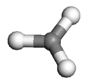
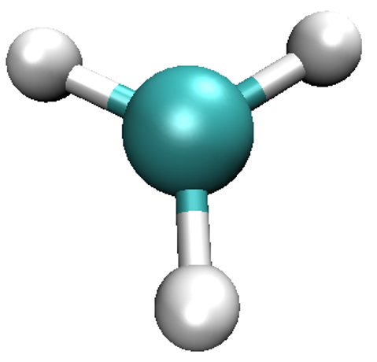
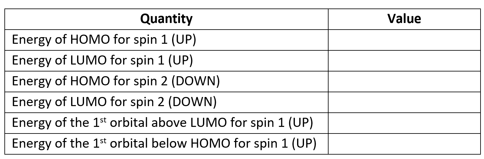
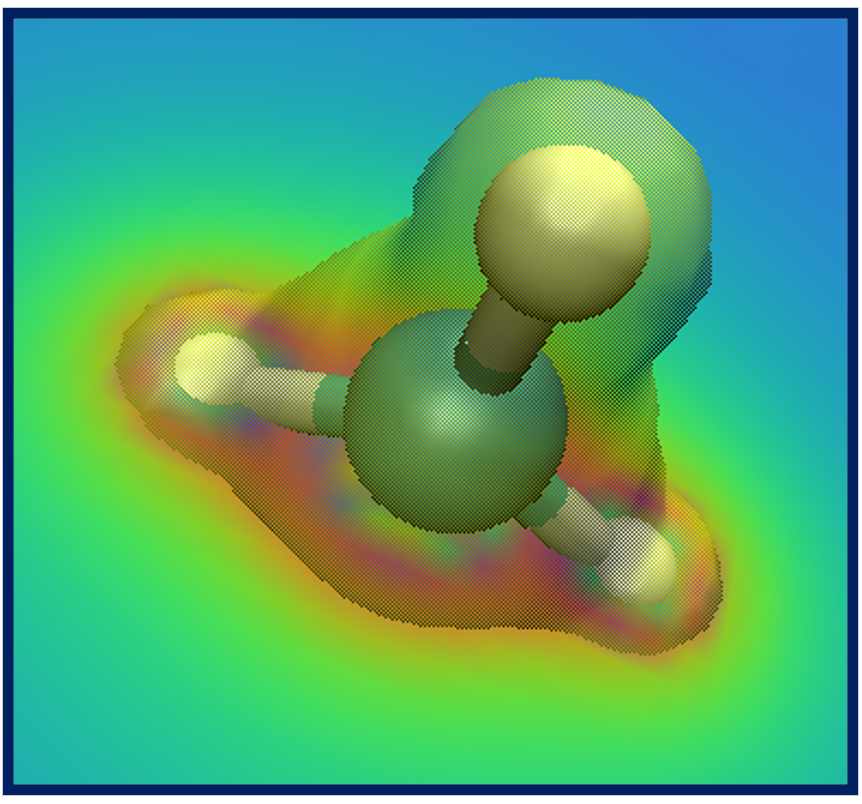
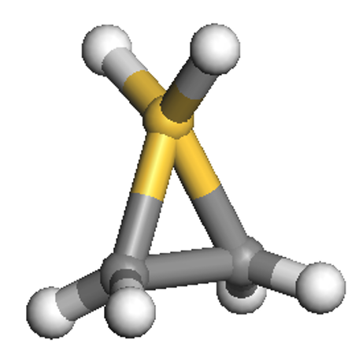
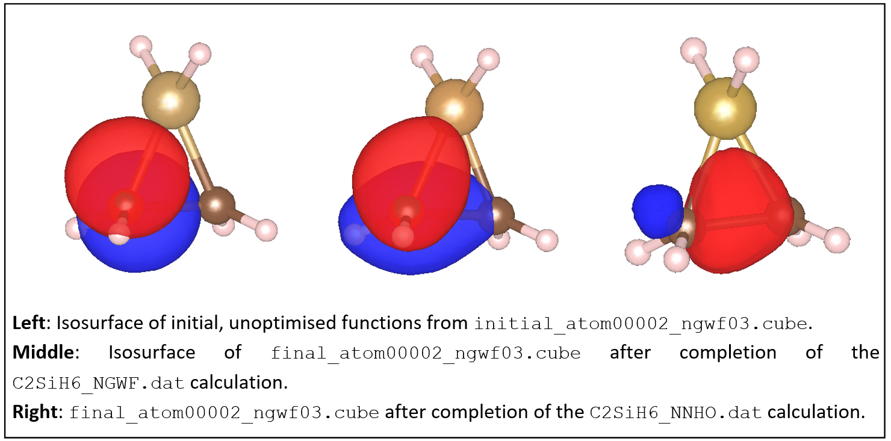
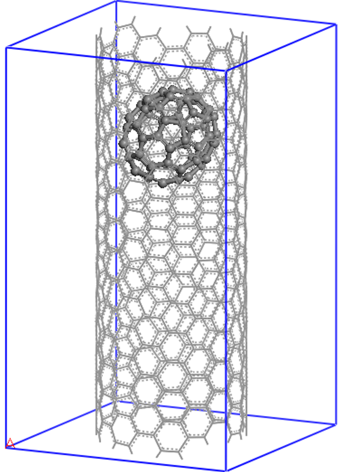
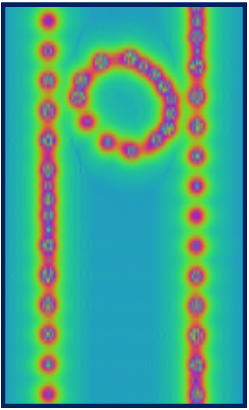
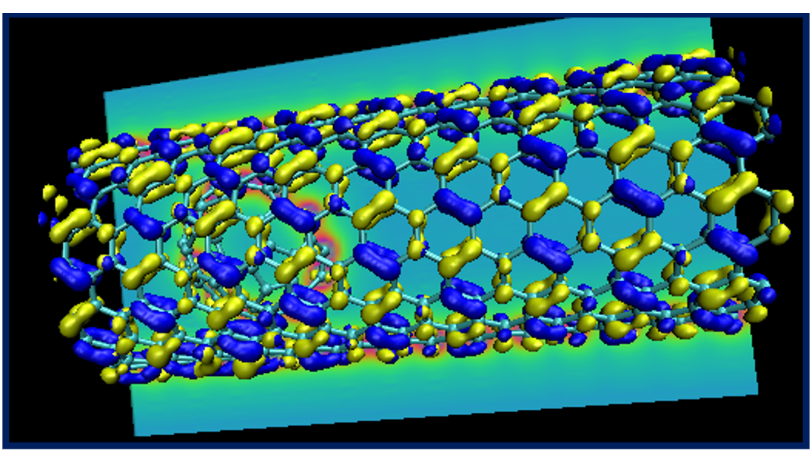

======================================
Tutorial 5: Analysis and visualization
======================================

:Author: Jacek Dziedzic, Chris-Kriton Skylaris
:Date:   July 2008 (revised April 2010, July 2023)

.. role:: raw-latex(raw)
   :format: latex
..

Introduction
============

This tutorial demonstrates how to:
  * Use ONETEP to calculate various electronic properties,
  * Instruct ONETEP to generate files needed for later visualization of orbitals, electronic densities and potentials,
  * Visualize these properties using VMD [1]_,
  * Set up and run a calculation on a nanostructure using a cut-off for the density kernel.

.. [1] VMD (Visual Molecular Dynamics) is a free of charge visualization package 
   available from https://www.ks.uiuc.edu/Research/vmd

Density, spin density, Kohn-Sham orbitals and the electrostatic potential for CH\ :sub:`3`
==========================================================================================
 
In this part we will perform a calculation on the CH\ :sub:`3` radical:

.. _Figure fig:CH3:

As this molecule contains an odd number of electrons we need to perform a spin-polarised (unrestricted) 
calculation. In ONETEP this is achieved by optimising a different density kernel for the "up" and the "down" spin:

.. .. _Figure fig:up_down_spin:
.. .. figure:: _static/tutorial_5/T5_up_down_spin.png
..    :alt: The density matrix for an unrestricted (spin-polarised) calculation.
..    :name: fig:T5_up_down_spin
..    :width: 30.0%
..    :align: center
..    :target: _static/tutorial_5/T5_up_down_spin.png

.. math::
   \rho\left(\mathbf{r}, \mathbf{r}^{\prime}\right)=\sum_{\alpha \beta} \phi_\alpha(\mathbf{r}) K^{\alpha \beta(\uparrow)} \phi_\beta^*\left(\mathbf{r}^{\prime}\right)+\sum_{\alpha \beta} \phi_\alpha(\mathbf{r}) K^{\alpha \beta(\downarrow)} \phi_\beta^*\left(\mathbf{r}^{\prime}\right)

The ONETEP input is in the file :download:`methyl.dat <_static/tutorial_5/methyl.dat>`
and the coordinates (in angstroem) are in the file :download:`methyl.pdb <_static/tutorial_5/methyl.pdb>`. 
The ONETEP input file contains the coordinates as well (in atomic units), but not in a form directly 
readable by visualization packages. The ``.pdb`` file can be directly visualized in VMD.

The :download:`methyl.dat <_static/tutorial_5/methyl.dat>` file specifies a single point energy 
calculation (``TASK SINGLEPOINT``) with a psinc kinetic energy cutoff of 800 eV (``CUTOFF_ENERGY 800.0 eV``), 
the Perdew-Zunger variant of the LSDA exchange-correlation functional (``XC_FUNCTIONAL CAPZ``) 
and the spin-polarised option (``SPINPOLARIZED TRUE``). Also notice the input flag ``DO_PROPERTIES TRUE``, 
which proceeds with the calculation of various electronic properties at the end of the single point 
energy calculation. 

Run the input, redirecting the output to a file such as ``methyl.out``. We also provide a reference
:download:`methyl.out <_static/tutorial_5/methyl.out>` file. The calculation should take a minute or two
to run. Once it completes, you will notice that a number of ``.cube`` files have been created, 
including the file :download:`methyl_spindensity.cube <_static/tutorial_5/methyl_spindensity.cube>`. 
Let us examine this first. ONETEP can output volumetric data (such as spin densities, charge densities, 
potentials, etc.) in Gaussian ``.cube`` format (``CUBE_FORMAT TRUE``), Materials Studio ``.grd`` format 
(``GRD_FORMAT TRUE``) and OpenDX ``.dx`` format (``DX_FORMAT TRUE``). The ``.cube`` format has the 
advantage of having the ionic positions output in addition to the volumetric data. In this tutorial 
we will use the ``.cube`` format which can be viewed with a number of free molecular visualisation 
programs. The instructions that follow are assuming that the VMD program can be used to visualize 
the files but in priciple you can use any other software that can display ``.cube`` files (such as 
VESTA, Molekel, gOpenMol, XCrySDens, etc).

Start VMD by typing ``vmd`` in the terminal, use ``File/New molecule/Browse`` to find 
``methyl_spindensity.cube``,  then click on ``Load`` to load the molecule. You should 
be able to see a crude, line-based representation of the molecule in a separate window. 
You can now get rid of the ``Molecule file browser`` window. Choosing ``Graphics/Representations...`` 
opens another window which lets you control the look of your molecule. In this window, 
change the ``Drawing Method`` from ``Lines`` to ``CPK``, which will render your molecule in a 
ball-and-stick fashion, with the customary colouring [2]_. Increase both ``Sphere Resolution`` and 
``Bond Resolution`` (30 is a good value) to get rid of the jagged edges. You may wish to 
adjust ``Sphere Scale`` and ``Bond Radius`` to your liking as well.

.. [2] The colouring is described here: https://en.wikipedia.org/wiki/CPK_coloring.

Try dragging with your mouse over the window that shows the molecule to rotate it. 
Try scrolling the mouse wheel to get closer or further away from the molecule. You may press 
the ``=`` key at any time to reset the view. Pressing the ``T`` key will get you to ``Translate Mode``,
where dragging with the mouse translates the molecule, instead of rotating it. To go back to 
``Rotate Mode``, press ``R``. If your mouse lacks the scroll wheel, pressing ``S`` to go to 
``Scale Mode`` might be of use. You should be able to obtain a representation similar to the one shown here.

.. _Figure fig:CH3_vmd:

So far we've only looked at the nuclei in the system. Let's try some electronic properties, 
starting from the spin density which we have already loaded, but not visualized yet. 
A neat thing about VMD is that you can use several representations at once. 
Thus, we can overlay the spin density isosurfaces on top of the CPK representation of the ions. 
In the ``Graphics/Representations...`` window click on ``Create Rep``. This will clone the 
CPK representation, leaving you with two identical representations. Now change one of 
them to ``Isosurface``. Not much will appear initially, because the default way of showing 
the isosurface is by using *points*. This is computationally cheap, but visually so as well. 
You can change this under ``Draw``, by choosing ``Solid Surface``. *Before you do it*, 
however, make sure to move the ``Isovalue`` slider to something different than the 
default 0.0 (or type a value in the box). This is because there is a huge number of 
points in our system (some 400000) where the spin density is exactly or almost exactly zero 
(everywhere outside our molecule). Trying to draw a surface through these points usually 
confuses VMD to the point of crashing or at least stuttering. For this reason it is best to 
pick any value other than the default of 0.0 to start from, before choosing ``Solid Surface``. 

Experiment with the settings (``Coloring Method``, ``Material``, ``Isovalue``) to get a feel for 
how they work. It makes sense to set ``Coloring Method`` to ``ColorID`` here, as this lets us
to manually pick a colour for the isosurface (from the drop-down box near ``ColorID``). 
After some adjustments you should obtain an isosurface similar to the one shown here. 
Do not worry if you cannot get the transparency right -- it's -- only possible when you render 
"production quality" images, think of what you see as a draft.

.. _Figure fig:CH3_vmd2:
.. figure:: _static/tutorial_5/T5_CH3_vmd2.png
   :alt: The spin density of the CH3 radical visualized in VMD.
   :name: fig:T5_CH3_vmd2.png
   :width: 40.0%
   :align: center
   :target: _static/tutorial_5/T5_CH3_vmd2.png

What we have obtained is the textbook picture of the spin density of a methyl radical. 
It has positive as well as negative regions which is a consequence of the fact that 
the spatial parts of the Kohn-Sham orbitals for each spin are allowed to be different, 
even for doubly occupied states. 

The properties calculation also produces *Kohn-Sham orbitals*. Their energies for each 
spin are printed in the output file (try to find them, they are towards the very end,
copy them into the table below) and ``.cube`` files for the squares of some of the 
orbitals are also produced. HOMO orbitals are written, separately for each spin, 
to :download:`methyl_HOMO_DN.cube <_static/tutorial_5/methyl_HOMO_DN.cube>` and
:download:`methyl_HOMO_UP.cube <_static/tutorial_5/methyl_HOMO_UP.cube>`, and
their LUMO counterparts to :download:`methyl_LUMO_DN.cube <_static/tutorial_5/methyl_LUMO_DN.cube>` and
:download:`methyl_LUMO_UP.cube <_static/tutorial_5/methyl_LUMO_UP.cube>`.
Similarly named files contain the orbitals just below the HOMO and just above the LUMO (not provided
here, but generated during the calculation).

.. _Figure fig:CH3_table:

Finally, let's try visualizing the local potential (sum of the ionic, Hartree (Coulomb) and XC potentials), 
which is written out to :download:`methyl_potential.cube <_static/tutorial_5/methyl_potential.cube>`. 
Isosurface plots of potentials can be obtained similarly to the isosurface plots of densities. 
Let's also try to do a contour plot. This can be accomplished by choosing ``VolumeSlice`` for 
``Drawing Method``. Try playing with ``Slice Axis`` and ``Slice Offset`` to get the hang of it. 
Admittedly, the quality of the contour plot is not too good, even if you set ``Render Quality`` to 
``High``. It is improved, however, when you create a production image. Try obtaining a 
composite CPK + isodensity + contour plot similar to the one shown here.

.. _Figure fig:CH3_vmd3:

|

Visualizing NGWFs and NNHOs for C\ :sub:`2`\ SiH\ :sub:`6`\
===========================================================

In this example we will perform two sets of calculations on the C\ :sub:`2`\ SiH\ :sub:`6`\ molecule:

.. _Figure fig:C2SiH6:

|

The first calculation will use the input file :download:`C2SiH6_NGWF.dat <_static/tutorial_5/C2SiH6_NGWF.dat>`,
which has similar parameters (and, thus, keywords) to the previous example but also contains the 
``WRITE_NGWF_PLOT TRUE`` keyword that allows output of selected NGWFs in the scalarfield formats we
discussed earlier (``.cube`` by default). The NGWFs that will be outputted are selected by the 
``species_ngwf_plot`` block in which the *species* of atoms whose NGWFs are to be outputted are 
listed. In this example we output NGWFs of the Si atom and of the first H and C atoms (as written 
in the input coordinates). The second input file is :download:`C2SiH6_NNHO.dat <_static/tutorial_5/C2SiH6_NNHO.dat>`,
which contains the additional keyword ``NNHO TRUE`` which instructs ONETEP to perform a same-centre rotation of the 
NGWFs to transform them to non-orthogonal natural hybrid orbitals (NNHOs). These contain the 
same information as the NGWFs but are more "natural" as they conform with chemical concepts, 
such as being directed towards chemical bonds, and physical concepts, as in several of their 
properties they resemble proper Wannier functions. The mixing of NGWFs to NNHOs is done according to 
the procedure by Foster and Weinhold (J. P. Foster and F. Weinhold, *J. Am. Chem. Soc.* **102**, 7211 (1980)). 
For this calculation we will use the PBE GGA exchange-correlation functional (``XC_FUNCTIONAL PBE``).

Run the calculation to completion with the two inputs (in separate directories), 
it should take no more than five minutes for each of them. Reference outputs are provided here:
:download:`C2SiH6_NGWF.out <_static/tutorial_5/C2SiH6_NGWF.out>` and here:
:download:`C2SiH6_NNHO.out <_static/tutorial_5/C2SiH6_NNHO.out>`.

Examine some of the NGWF and NNHO output files. As an example, below we show plots of the 
third function (NGWF or NNHO) of atom 2 (one of the carbons). Try to obtain similar plots.

.. _Figure fig:C2SiH6_vmd:

You can observe that initially the function is a p-atomic orbital (as it is initialised by ONETEP). 
After the calculation the NGWF is rather distorted but still contains quite a lot of p character. 
The NNHO however is a mixture of all the 4 NGWFs of the carbon atom and is optimally pointed 
along the C-C bond. You can quantify these observations by comparing the two output files, 
:download:`C2SiH6_NGWF.out <_static/tutorial_5/C2SiH6_NGWF.out>` and 
:download:`C2SiH6_NNHO.out <_static/tutorial_5/C2SiH6_NNHO.out>`, which contain an ``NGWF s/p/d/f Character Analysis`` section
towards the bottom of the file (thanks to the ``NGWF_ANALYSIS TRUE`` keyword in the input). 
You will see how much the NGWFs differ from the NNHOs. Of course all the other quantities 
(energies, Kohn-Sham orbitals, orbital energies, etc.) are independent of whether you use NGWFs or NNHOs. 
Check this by completing the table below.

.. .. _Figure fig:C2SiH6_table:
.. .. figure:: _static/tutorial_5/T5_C2SiH6_table.png
..    :alt: Fill this table with the data found in the calculation output.
..    :name: fig:T5_C2SiH6_table.png
..    :width: 90.0%
..    :align: center
..    :target: _static/tutorial_5/T5_C2SiH6_table.png

.. _list-table C2SiH6:
.. list-table:: Calculated binding free energy of catechol to the protein.
   :header-rows: 1
   :align: center

   * - Quantity
     - Value
   * - Total energy of the system
     - 
   * - Energy of HOMO
     - 
   * - Energy of LUMO for spin 2(down)
     - 

Finally, examine the atomic population in the output files (we have asked for it using the keyword 
``POPN_CALCULATE TRUE`` in the input) and confirm that the charges on each atom are consistent 
with their relative electronegativities.

A calculation on a nanostructure
================================
 
Let us now see how to set up and visualize a calculation on a nanostructure whose size is in the 
region where conventional cubic scaling codes become very inefficient, while linear-scaling codes 
like ONETEP are still at the beginning of their capabilities. We will perform a calculation on 
the following "nano-peapod" structure, which consists of a C\ :sub:`70` fullerene
inside a single repeat-unit of a (10,8) carbon nanotube. 

.. _Figure fig:C70_in_10-8:

The (10,8) is a chiral nanotube with 
488 atoms in each repeat-unit, so the peapod input consists of 558 atoms, with no symmetry, 
in a unit cell of 20.0 x 20.0 x 33.27 (angstroem), which is equivalent to 37.795 x 37.795 x 62.874 (bohr). 
The ONETEP input is in the file 
:download:`C70_in_10-8.dat <_static/tutorial_5/C70_in_10-8.dat>`. We impose a density kernel 
cut-off of 30.0 bohr (``KERNEL_CUTOFF 30.0 bohr``) in order to achieve linear-scaling behaviour. 

This calculation is best run on a parallel computer, but you can run it on a desktop machine
where it should complete in about two-three hours. It took just under 8 minutes when run on 
5 nodes (360 CPU cores) in 2023. If you do not want
to wait or do not have the sufficient resources, here's the reference output: 
:download:`C70_in_10-8.out <_static/tutorial_5/C70_in_10-8.out>`.

Let us start by examining this file. At the beginning of the calculation the *filling* 
(the opposite of sparsity) of various matrices is reported. You will notice that the density 
kernel is not 100% full as a consequence of the cut-off that is imposed in the input. 
Information about the psinc grid sizes is also provided, including the actual plane-wave cut-off 
to which they correspond and the size of the FFT box. The calculation converges in 7 NGWF iterations, 
which is the point where the NGWF gradient threshold set in the input (``NGWF_THRESHOLD_ORIG 0.00003``) 
has been satisfied. Normally you'd likely use a tighter threshold for extra accuracy (the default
is 2E-6).

As before, a range of properties are calculated (``DO_PROPERTIES T``). As an example, 
you can examine the total potential (the sum of ionic, Hartree and exchange-correlation potentials) 
which is outputted to the file ``C70_in_10-8_PROP_potential.cube``. We do not provide this file
here due to size considerations. A contour plot on a plane containing the nanotube axis of the 
potential will look similar to what you see below, which is compatible with the chiral 
nature of the nanotube and reveals also the asymmetric way in which the oblong C\ :sub:`70` is
is located inside it. 

.. _Figure fig:C70_in_10-8_vmd:

Red regions correspond to large and positive values of the potential 
(standard electrostatic conventions) and reveal the location of nuclei, whose distance from 
the plane varies along the axis of the tube, as a result of the chirality. You can go on and 
explore other properties of the nano-peapod from the :download:`C70_in_10-8.out <_static/tutorial_5/C70_in_10-8.out>` 
file and the other output files that were produced by the properties calculation.

If you are in an ambitious mood, try creating a fancy plot showing the structure of the 
nano-peapod system with its HOMO and LUMO orbitals and a contour plot of the potential, similar 
to the one below.

.. _Figure fig:C70_in_10-8_vmd2:

|

This completes tutorial 5.
