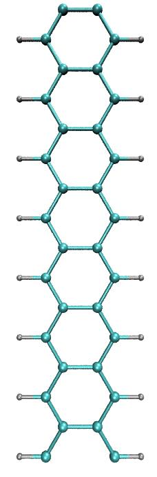

==============================
Tutorial 6: Time-Dependent DFT
==============================

:Author: Tim Zuehlsdorf
:Date: January 2016 (revised August 2023)

.. role:: raw-latex(raw)
   :format: latex
..

  

TDDFT in ONETEP
===============

This tutorial aims at showing how to run a simple linear-response TDDFT calculation in ONETEP.
Linear-response TDDFT is the main method of choice when computing optical excitations for
large system sizes. In this formalism, excitation energies are directly obtained as the solutions to
an effective eigenvalue equation. The approach implemented in ONETEP can be made to scale
fully linearly with systems size, allowing for the computation of excitations in systems containing
thousands of atoms.

In linear-response TDDFT, an excitation is expressed through a transition vector that can be
written in the basis of all possible Kohn-Sham transtions from occupied to unoccupied states.
Thus unlike in standard ground state DFT, where a good representation of the occupied KohnSham states is sufficient 
to obtain accurate results, in a TDDFT calculation an equally good
representation of a subset of the unoccupied Kohn-Sham space is vital. Since the ONETEP
support functions are optimised *in situ* to ideally represent the occupied manifold, they generally
provide a relatively poor description of the unoccupied manifold, making them insufficient for
describing excitations in a linear-response framework. In practice, this problem is removed by
optimising a second set of support functions to ideally span a low energy subset of the conduction
space in a post-processing step after a ``Singlepoint`` calculation. Together, the two sets of support
functions form an ideal representation of any given low energy excitation, thus enabling efficient
iand accurate TDDFT calculations in very large systems.

Setting up a TDDFT calculation in ONETEP
========================================

A TDDFT calculation in ONETEP thus proceeds in three separate steps:
  * A standard ground state calculation using ``Task: Singlepoint``. The code will write out ``.dkn`` and ``.tightbox_ngwfs`` files containing the valence density kernel and the NGWF support functions.
  * A conduction optimisation using ``Task: Cond``. The code will read in the converged ``.dkn`` and ``.tightbox_ngwfs`` files from the ground-state optimisation and perform a postprocessing ``conduction optimisation`` of some low energy part of the conduction space manifold. It will write out ``.dkn_cond`` and ``.tightbox_ngwfs_cond`` files containing an effective density kernel for the low energy conduction space, as well as the NGWF support functions for the conduction space.
  * A TDDFT calculation using ``Task: Lr_tddft``. The code will read in the density kernels and support functions for both the ground state and the conduction space calculations and then calculate the lowest *n* excitations of the system, where *n* is determined by the keyword ``lr_tddft_num_states``.

In practice, it is possible to string these tasks together using ``Task: Singlepoint Cond Lr_tddft``
in an input file that lists appropriate keywords for all three calculation types. The tasks will be
performed one after another, without the user having to restart the calculation in between.

An NN-substituted nanoribbon
============================

We turn to a simple example of an excited state calculation in a periodic system, namely that of
an infinitely long graphene nanoribbon with two nitrogen substitutions. We will aim to compute
excited states that are associated with the substitution and that are thus relatively localised in
character. In a first step, we aim to build an input file for a pristine graphene nanoribbon in
periodic boundary conditions. A primitive unit cell for the nanoribbon in question can be found
below:

| %block positions_abs
| C 10.90 10.0 0.000
| C 13.58 10.0 0.000
| H 7.50 10.0 2.327
| C 9.56 10.0 2.327
| C 14.93 10.0 2.327
| H 16.99 10.0 2.327
| %endblock positions_abs

To generate an appropriate input file, copy the above primitive unit cell block into a new input
file called ``ribbon.dat``. ONETEP does not make use of any *k*-point sampling and all calculations
are effectively done at the :math:`\Gamma`-point. Therefore, in order to accurately simulate periodic structures
it is necessary to simulate supercells rather than primitive cells as would be done in standard
plane wave DFT codes. An appropriate supercell from the above primitive cell can be created by
repeating the primitive cell 7 times along the z-axis, translating the z-coordinates of the atoms
by the lattice vector of the primitive unit cell. The resulting supercell should contain 48 atoms
in total.

Now create an appropriate ``%block lattice_cart`` for the system. The length of the supercell is
specified by the length of your primitive cell and the number of repeats of that cell. However,
the size of the unit cell in the x and y direction is free to specify by the user. Since the ONETEP
method uses periodic boundary conditions in all three directions, it is necessary to include enough
vacuum in the x and y direction of the simulation cell to prevent it from interacting with its
periodic neighbours. In this case, about 20 :math:`{a}_{0}` of vacuum between any atoms of different periodic
images is a reasonable length.

Using the lessons learnt from previous tutorials add a %block species and %block species_pot
block to your input file. Choose an appropriate NGWF radius (try 8 :math:`{a}_{0}`) and kinetic energy cutoff
(around 600 eV) for your calculation. When choosing the NGWF radius, note that ONETEP will
not allow you to pick an NGWF diameter that is larger than the dimensions of your simulation
cell, as this would cause an NGWF to interact with its periodic image. Finally, perform a
singlepoint calculation of the system. You can add a keyword ``do_properties: T`` to the input
file. This will trigger the code to perform a properties calculation, write out a file ``.val_bands``
containing all Kohn-Sham energies and write cube files of selected Kohn-Sham states around the
band gap.

Conduction optimisation
+++++++++++++++++++++++

Once the ground state calculation is finished, it is necessary to perform a conduction optimisation.
First, set ``Task: Cond`` and add a new block ``%block species_cond`` to the input file. This block
is made up in an identical way as ``%block species`` and specifies the number of support functions
and their radius in the conduction optimisation. In many practical examples, it is often advisable
to choose a larger NGWF radius for the conduction optimisation than for the ground state
calculation, especially if one is interested in lightly bound states, as unoccupied Kohn-Sham
states tend to be more diffuse than occupied ones (try 10 :math:`{a}_{0}` for example).

A second keyword required for the conduction optimisation is the number of conduction states
that should be explicitly optimised (``cond_num_states``). It is normally advisable to optimise only
well-bound states as unbound states are difficult to describe with localised orbitals. In order to do
so, have a look at the file ``.val_bands`` and count the number of Kohn-Sham states with negative
energy that are unoccupied. Note that ``cond_num_states`` expects the number of electrons to be
optimised as an input, thus in order to optimise the five lowest unoccupied Kohn-Sham states in
a spin-degenerate system, one should choose ``cond_num_states: 10``.

Once you have run the calculation, have a look at the output. You will find that ONETEP
has generated a number of files such as cube files of unoccupied Kohn-Sham states expressed in
terms of the optimised conduction NGWFs.

TDDFT calculation
+++++++++++++++++

We can now perform a full ONETEP TDDFT calculation of the system at hand. To do so, set
``Task: Lr_tddft`` in the input file. Furthermore, add the keywords ``lr_tddft_num_states: 6``,
``lr_tddft_write_densities: T`` and ``lr_tddft_analysis: T``. The code will compute the lowest 8 singlet excitations of the system and generate cube files for the electron, hole and transition
density for each excitation that can be visualised. Furthermore ``lr_tddft_analysis: T`` triggers
a breakdown of the converged TDDFT eigenvectors into Kohn-Sham transitions, allowing you
to study which are the dominant transitions for each excitations.

Once you have performed the TDDFT calculation, look at the output file. You will see that the
excitation energies and oscillator strengths for each of the excitations are printed out, as well as
a detailed breakdown of excitation energies into Kohn-Sham transtions. Have a look at some of
the cube files produced. Where are the excitations located in the system?

Nitrogen substitution
+++++++++++++++++++++

We can now move on from the case of the pristine nanoribbon to one with two nitrogen substitutions. 
For this purpose, copy the input file ``ribbon.dat`` to a new file ``ribbon_NN.dat``. In that file,
remove two C-H from the ``%block positions_abs`` that are opposite to each other in the ribbon,
and replace them by two N at the same positions where the C were located.

 |figure1| |figure2| 

Right: Pristine nanoribbon. Left: Nanoribbon with for two carbons and two hidrogen substituted for two nitrogens

Note that in order to run the calculation, you will have to add the nitrogen species to the 
``%block species_pot``, ``%block species`` and ``%block species_cond`` blocks. 
Change the task to ``Task: Singlepoint Cond Lr_tddft``.
The code will run a ground state and conduction optimisation, followed by a TDDFT calculation for the full system.
Have a look at the output. How do the excited states change due to the nitrogen substitutions? 
Where is each excited state located within the system?

Additional tasks
================

Substituting nitrogen atoms in the same place as carbon atoms does not yield a relaxed ground
state structure, as the N-C bond is not of the same length as the C-C bond. Thus in order to
obtain more realistic results for the substituted system, perform a geometry optimisation (see
tutorial 4), followed by a ground state, conduction and TDDFT calculation of the full system.
How do the results change? Furthermore, create a system where the nitrogen atoms are not
substituted at exactly opposite positions in the structure, but an asymmetry along the z-axis is
introduced. How does the character of the low energy excitations change?

Input files
===========

All the files needed for the simulation can be downloaded from

- :download:`ribbon_pristine.dat <_static/tutorial_6/ribbon_pristine.dat>`
- :download:`ribbon_pristine_NN.dat <_static/tutorial_6/ribbon_pristine_NN.dat>`
- :download:`carbon.recpot <_static/tutorial_6/carbon.recpot>`
- :download:`hydrogen.recpot <_static/tutorial_6/hydrogen.recpot>`
- :download:`nitrogen.recpot <_static/tutorial_6/nitrogen.recpot>`

