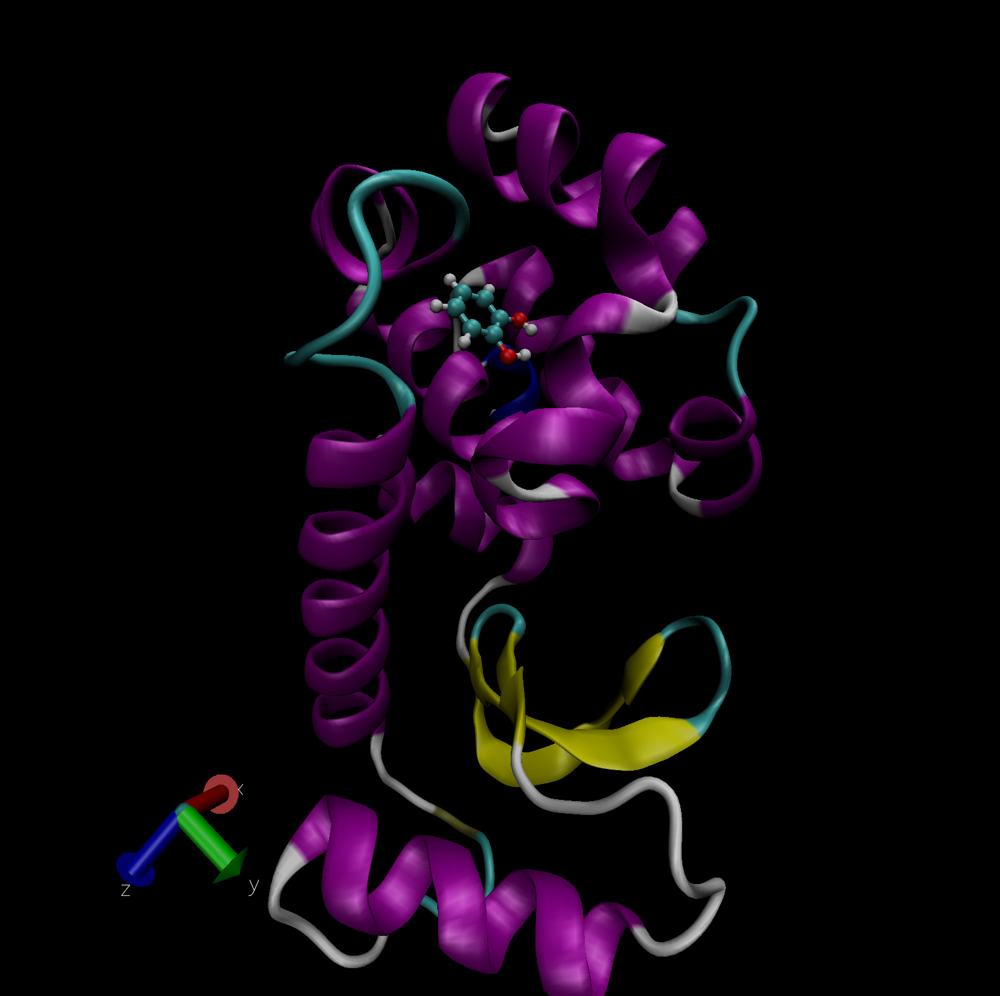
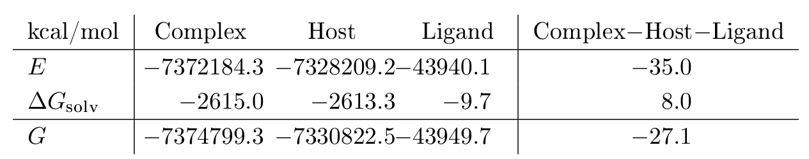
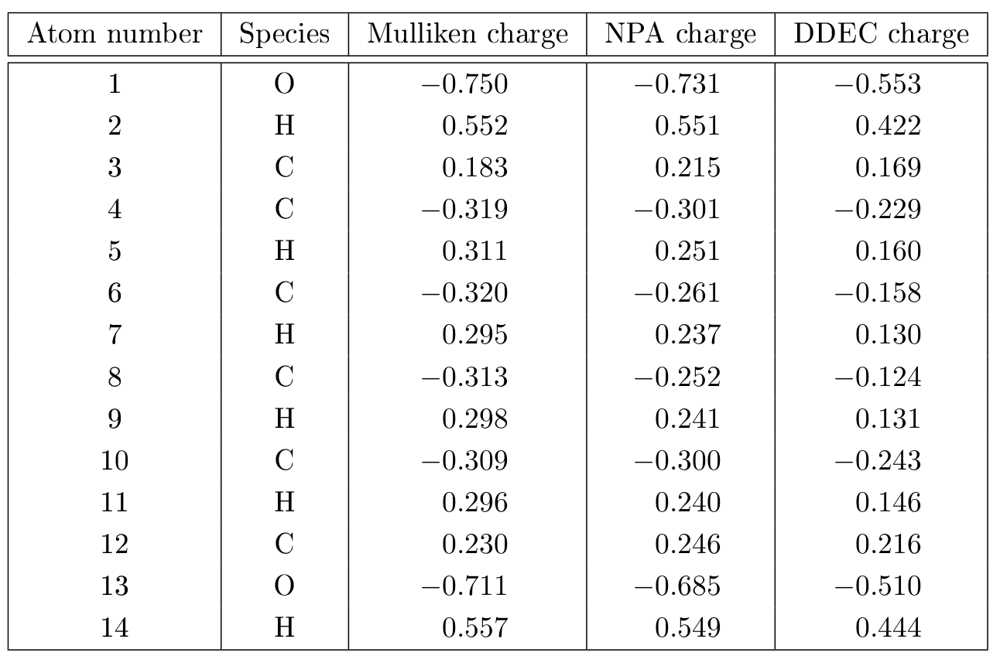
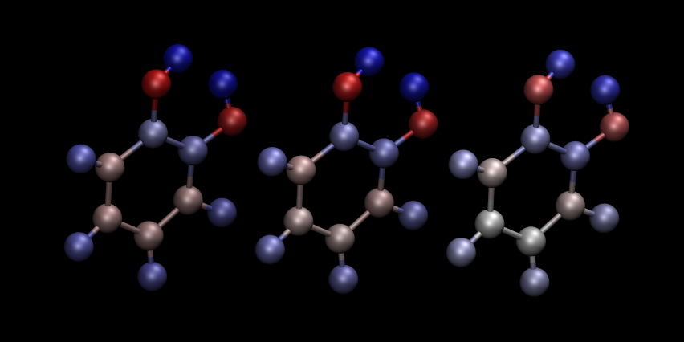

=======================================================================================================================
Tutorial 8: Implicit solvation, visualisation and properties: Protein-ligand free energy of binding for the T4 lysozyme
=======================================================================================================================

:Author: Lennart Gundelach, Jacek Dziedzic
:Date:   June 2021 (revised June 2023)

.. role:: raw-latex(raw)
   :format: latex
..

Introduction
============

Protein-Ligand Free Energies of Binding
---------------------------------------

The binding free energy is a measure of the affinity of the process by
which two molecules form a complex by non-covalent association. An
example of this, of central importance in biology, is the binding of a
ligand to a protein. Many methods to computationally approximate the
binding free energies of protein-ligand interactions have been proposed
with the ultimate goal of computationally predicting small molecule drug
candidates which bind strongly to the protein of interest.

Quantum Mechanics in Binding Free Energies
------------------------------------------

A key limitation common to most computational methods of estimating
binding free energies is the assumption of the validity of classical
mechanics. The atoms and electrons that constitute biological molecules,
like proteins, are, however, governed by the laws of quantum mechanics.
Charge transfer, polarization and non-local interactions are not
captured by traditional classical mechanical force-fields. Thus, a true
description of protein-ligand binding requires a quantum mechanical (QM)
treatment of the problem. In theory, a full, *ab-initio* QM approach
would be system-independent, parameter-free and would describe the full
spectrum of physical phenomena at work.

Unfortunately, high-level QM methods like coupled-cluster (CC) are
prohibitively expensive and often have cubic or worse scaling with
system size. Thus, even the ligands alone are often too large for
routine calculations with these methods.

Linear Scaling Density Functional Theory
----------------------------------------

Due to the cubic scaling of conventional density functional theory,
full-protein calculations on many thousands of atoms are not feasible.
To study larger systems, linear-scaling versions of DFT have been
developed [Bowler2012]_. The ONETEP
code [Prentice2020]_ is one such linear-scaling DFT
implementation, exploiting hybrid MPI-OMP
parallelism [Wilkinson2014]_ for efficient and scalable
calculations. The unique characteristic of ONETEP is that even though it
is linear-scaling, it is able to retain large basis set accuracy as in
conventional cubic-scaling DFT calculations. The implicit solvation
model is a minimal-parameter Poisson-Boltzmann (PB) based model which is
implemented self-consistently as part of the DFT
calculation [Dziedzic2011]_ [Womack2018]_ and uses the
smeared-ion formalism and electron-density iso-surfaces to construct
solute cavities.

T4 Lysozyme
-----------

The protein under investigation in this tutorial is a double mutant of
the T4 lysozyme (L99A/M102Q). This protein has been artificially mutated
to form a buried polar binding site and has served as a model or
benchmark system for various protein-ligand binding free energy
studies [Mobley2017]_. Although this protein is not
directly pharmaceutically relevant, it is a useful model system due to
it its relatively small size (2500 atoms), structural rigidity and
well-defined, buried binding site, which can accommodate a wide variety
of ligands. :numref:`Figure fig:T4` shows the ligand catechol inside the
buried binding site of the T4 lysozyme L99A/M102Q mutant. PDB files of
the complex, host and ligand are provided as part of this tutorial for
you to visualize the system. The picture shown uses the ``NewCartoon``
representation for the protein with coloring based on secondary
structure and ``CPK`` (ball-and-stick) for the ligand with element based
coloring.

.. _Figure fig:T4:

   Catechol bound in the buried binding site of the T4 lysozyme
   L99A/M102Q double mutant. Visualization in VMD.

QM-PBSA Binding Free Energies
-----------------------------

In this tutorial we will calculate the binding free energy of catechol
to the T4 lysozyme L99A/M102Q mutant. We will employ a simplified
QM-PBSA approach [Fox2014]_ [Gundelach2021]_ on a single
snapshot of the protein-ligand complex.

The QM-PBSA approach is a quantum-mechanical adaptation of traditional
MM-PBSA, which is an end-point, implicit solvent, binding free energy
method. In this approach, the binding free energy is given by

.. math::
   :label: net

   \Delta G_{\textrm{bind}}= G_{\textrm{complex}} - G_{\textrm{host}} - G_{\textrm{ligand}},

where :math:`G_{\textrm{complex}}`, :math:`G_{\textrm{host}}`, and
:math:`G_{\textrm{ligand}}` is the free energy of, respectively, the
complex, host and ligand in an implicit solvent. Each of these can be
decomposed into three terms,

.. math::
   :label: energy_terms

   G=E + \Delta{}G_{\textrm{solv}} - TS,

where :math:`E` is the total gas-phase energy,
:math:`\Delta{}G_{\textrm{solv}}` is the free energy of solvation and
:math:`-TS` is an entropy correction term. In this tutorial, the entropy
term will be ignored, as it is usually calculated in other programs
using normal mode analysis. The linear-scaling DFT code ONETEP will be
used to calculate the gas-phase and solvation free energy of the
complex, host and ligand at a fully quantum-mechanical level.

Setting up the calculations
===========================

We will set up three separate calculations, one each for the
protein-ligand complex, the protein (host) and catechol (ligand). The
structure of the complex was taken from a molecular dynamics
simulation of the complex used in two QM-PBSA studies on this system
[Fox2014]_ [Gundelach2021]_. The structure of the
unbound ligand and host were obtained from the complex by deletion of
the respective molecules. Apart from the atomic coordinates, we must
specify the details of the ONETEP single-point calculations, provide
pseudopotentials for the atoms present in the system and adapt job
submission scripts to run the calculations on the supercomputer of
choice.

The input files
---------------

The ONETEP input file, referred to as the ``.dat`` file, contains two
main elements: 1) the coordinates and atom types of the system (i.e the
structural information) and 2) the details of the calculation. Due to
the large system size, we have split theses two components across
separate files: the ``.dat`` file, which contains the structural
information, and a ``.header`` file which contains instructions for
ONETEP. This header file is included in the ``.dat`` file via the
command ``includefile``. All information could also be contained in a
single ``.dat`` file; however, the use of a separate header file can
make it easier to set up hundreds or even thousands of calculations
which differ only in the coordinates and not the calculation settings.

``.dat`` file
~~~~~~~~~~~~~

The two blocks included in the ``.dat`` file are ``lattice_cart`` and
``positions_abs``, which specify the simulation cell and absolute
positional coordinates of each atom within the simulation cell,
respectively. The ``includefile`` command on the first line specifies
the header file to include for the calculation.

``.header`` file
~~~~~~~~~~~~~~~~

This ``.header`` file contains all further details of the ONETEP
calculation. The ``species`` block specifies the name, element, atomic
number, number of NGWFs and the NGWF radius for each atom type in the
system. The ``species_pot`` lists the names of the pseudopotential files
for each atom type. The rest of the file consists of ONETEP keywords
which control the details of the calculation. The provided header files
are fully commented, and details on each keyword are given in the ONETEP
keyword directory (http://onetepkeywords.icedb.info/onetepdoc). We will
be performing single-point energy calculations using the PBE
exchange-correlation functional, the D2 dispersion correction and
ONETEP’s minimal paramater implicit solvent model. The calculation will
output verbose detail and an ``.xyz`` file for easy visualization. The
total system charge is +9 for the complex and host and 0 of the ligand.
The implicit solvent is set to use the default parameters for water.

Submission Scripts
------------------

Due to the large system size of over 2500 atoms, these single-point
calculations can only be run on a supercomputer. Thus, a submission
script appropriate for the HPC environment you are working on will be
necessary. The standard distribution of ONETEP provides sample
submission scripts for a variety of HPC systems. These can be found in
your ONETEP directory under ``hpc_resources``.

We recommend to run the complex and host calculations on multiple
compute nodes, making full use of the hybrid MPI-OMP capabilities of
ONETEP. On the national supercomputer ARCHER2, the use of 4 compute
nodes (128 cores each) with 32 MPI processes and 16 OMP threads per
process results in a wall-time of about 8 hours. Due to the much smaller
size of the ligand, the calculation on the ligand in solvent should be
limited to a single node, with at most 10 MPI processes.

Evaluating the Outputs
======================

Upon successful completion of the calculations, we will examine the
three ``.out`` files created. Each of these files contains the full
details and log of the calculation, as well as the final results and
some timing information. While much information about the system can be
gained from the output files, we will focus first only on the final
results necessary to estimate the binding free energy of the ligand,
catechol, to the protein.

.. This is what it looked like in the original LaTeX after parsed by pandoc:
  | l|d8.0d8.0d5.2\|d5.2 kcal/mol & & & &
  | :math:`E` & -7372184.3 & -7328209.2 & -43940.1 & -35.0
  | :math:`\Delta{}G_{\textrm{solv}}` & -2615.0 & -2613.3 & -9.7 & 8.0
  | :math:`G` & -7374799.3 & -7330822.5 & -43949.7 & -27.1

.. _Figure T8_energies:

   Calculating the binding free energy of catechol to the protein.

As outlined in equations :eq:`net` and :eq:`energy_terms` we need to calculate the total free
energy of the complex, host and ligand before subtracting the total
energy of the host and ligand from that of the complex. As stated
before, we will be ignoring any entropy contributions in this tutorial.
The total energy is then the sum of the total gas phase energy and the
solvation free energy. These energies are summarized in an easy to read
section at the very end of the output files, just before the timing
information. To find it, search the output file for
``Total energy in solvent``. This section breaks down the different
energy contributions and states the total energies in vacuum (gas phase)
and in solvent as well as the solvation free energy. :numref:`Figure T8_energies` summarizes the energy values obtained.
To estimate the binding free energy we simply apply equation
:eq:`net` to yield:

.. math::

  \begin{aligned}
  \Delta G_{\textrm{bind}}&=G_{\textrm{complex}}-G_{\textrm{host}}-G_{\textrm{ligand}}=\\
  &=-7374799.3 -(-7330822.5) - (-43949.7) = -27.1 \textrm{kcal/mol}
  \end{aligned}
  .

Thus, the estimated binding energy of catechol to the T4 lysozyme is
-27.1 kcal/mol. However, there are a number of severe limitations of
this estimate: 1) the entropy correction term :math:`-TS` has been
neglected; 2) only a single snapshot was evaluated; 3) the implicit
solvent model incorrectly interprets the buried cavity in the T4
lysozyme, and 4) the QM-PBSA method is designed to calculate relative
binding free energies between similar sets of ligands. For an in depth
look at the full application of the QM-PBSA binding free energy method
to 7 ligands binding to the T4 lysozyme and a discussion of the errors,
convergence and limitations of the method, please consult our recent
publication [Gundelach2021]_.

Cavity Correction
-----------------

The minimal-parameter PBSA solvent-model implemented in ONETEP
incorrectly handles the buried cavity in the T4 lysozyme (L99A/M102Q).
This is a known issue for solvent models based on the solvent accessible
surface area, and has been described in detail in 2010 by Genheden *et
al.* [Genheden2010]_, and in 2014 by Fox *et al.* [Fox2014]_.

In the un-complexed protein calculation, i.e the host, the surface area
of the interior of the buried binding site is counted towards the
solvent accessible surface area (SASA) used to calculate the non-polar
solvation term. Thus, the non-polar term of just the protein is larger
than that of the complex indicating the formation of a larger cavity in
the solvent. Conceptually, the SASA model creates an additional,
fictitious, cavity in the solvent with the SASA of the buried binding
site. Because the non-polar term of both the protein and complex are
known, a post-hoc cavity-correction may be applied to remove the
additional (spurious) contribution of the buried cavity to the non-polar
solvation energy. A full derivation is provided in [Fox2014]_.

.. math::

   E_{\textrm{cav-cor}}=7.116(E^{\textrm{host}}_{\textrm{non-polar}}-E^{\textrm{complex}}_{\textrm{non-polar}})=7.116(289.5 - 286.2) = 23.5 \text{ kcal/mol}.
       \label{eq:cav-cor}

Applying the cavity correction term calculated above to the binding free
energy, we obtain a cavity-corrected binding free energy of
:math:`-27.1 + 23.5 = -3.6` kcal/mol. For comparison, the experimental
binding energy of catechol to the T4 lysozyme is -4.4 kcal/mol. It
should however be noted, that the close correspondence of this single
snaphot QM-PBSA binding free energy to the absolute experimental energy
is likely a lucky coincidence, as the QM-PBSA method is mainly
applicable to relative binding free energies and the entropy correction
term has not yet been included.

Properties
==========

We will now show how a number of useful properties of the system can be
studied through a *properties calculation*. In the interest of saving
computational time, and for clarity of presentation, we will use the
ligand system as an example.

| Add the following keywords to the ``.header`` file of the ligand
  calculation:
| ``do_properties T``
| ``dx_format T``
| ``cube_format F``
| and run it again.

The first of these keywords instructs ONETEP to perform a *properties
calculation* towards the end of the run. This will calculate, among
others, Mulliken charges on the atoms, bond lengths, the HOMO-LUMO gap,
the density of states (DOS) and some grid-based quantities, such as the
HOMO and LUMO canonical molecular orbitals, electronic charge density
and potential. The grid-based quantities (often called *scalarfields*)
can be output in three different formats: ``.cube``, ``.dx``, and
``.grd``. By default ``.cube`` files are written, and not the other two
formats. In this example we switch off ``.cube`` output and turn on
``.dx`` output. This is effected by the last two keywords.

Once your calculation finishes, you will see that quite a number of
``.dx`` files have been produced:

-  ...\ ``_HOMO.dx`` – density of the canonical HOMO orbital.

-  ...\ ``_LUMO.dx`` – density of the canonical LUMO orbital.

-  ...\ ``_HOMO-``\ :math:`n`\ ``.dx`` – density of the :math:`n`-th
   canonical orbital below HOMO.

-  ...\ ``_LUMO+``\ :math:`n`\ ``.dx`` – density of the :math:`n`-th
   canonical orbital above LUMO.

-  ...\ ``density.dx`` – the electronic density of the entire system.

-  ...\ ``potential.dx`` – the total potential (ionic + Hartree + XC) in
   the system.

-  ...\ ``electrostatic_potential.dx`` – the electrostatic potential
   (ionic + Hartree) in the system.

These files correspond to the calculation in solvent. There will be a
second set of ``.dx`` files with ``vacuum`` in their names – these
correspond to the calculation in vacuum. This lets you study and
visualize in-vacuum and in-solvent properties separately and to perform
comparisons between the two. Here, you can expect the scalarfields to be
rather similar between in-vacuum and in-solvent because the ligand is
charge-neutral and polarizes the solvent only very slightly.

There is a separate tutorial (Tutorial 5) devoted to visualization. You
can use the skills taught there to create fancy visualizations of the
properties of your choice. Here we will only show how to produce a neat
visualization of the electronic density coloured by the electrostatic
potential using VMD.

Load the electronic density and the electrostatic potential into one
molecule, and the atomic coordinates into a separate molecule. This will
make it easier treat the scalarfields and the atomic coordinates
separately. To achieve this, issue:

::

   vmd ligand_2001_density.dx ligand_2001_electrostatic_potential.dx -m ligand_2001.xyz

Once VMD loads the files, go to ``Graphics/Representations``. Ensure
``Selected Molecule`` (at the top of the window) is the ``.xyz`` file
(atomic coordinates). Under ``Drawing Method`` Choose ``CPK`` – this
will create a ball-and-stick drawing of the ligand. Switch
``Selected Molecule`` to the ``.density.dx`` file to operate on the
electronic density scalarfield. Under ``Drawing Method`` choose
``Isosurface`` if it is not chosen already. Choose an ``Isovalue`` of
``0.1`` to pick a reasonable density isovalue to plot. Under
``Coloring Method`` choose ``Volume`` (you might need to scroll to the
very bottom to get there). In the tiny drop-down window to the right of
``Coloring Method`` switch from scalarfield 0 (the density itself) to
scalarfield 1 (the potential) – this will colour the density *with* the
potential. For ``Material`` (further to the right) choose ``Glass2`` –
this will choose a somewhat translucent material that will let us see
both the ball-and-stick model and the electronic density. Under ``Draw``
in the bottom-right of the window, choose ``Solid Surface`` instead of
``Points``. Finally, let’s change the range of the potential to the
kinds of values that occur at the distance from the molecule at which
our electronic density isosurface lies. These have been determined by
trial and error. There are four tabs just above ``Coloring Method``.
Somewhat counterintuitively, switch to ``Trajectory``, where, under
``Color Scale Data Range`` you can enter the minimum and maximum values
for the potential (in eV). Enter ``-1`` in the left field and ``1.5`` in
the right field and click ``Set``. This should give a nice
representation, which you can then rotate and translate to your liking
using the mouse in the ``OpenGL Display`` window. Once you are
satisfied, you can render the final image by going to ``File/Render``.
In the top drop-down menu choose ``Tachyon`` and click on
``Start Rendering``. After a short while you will get a ``.tga`` (“TARGA
format”) file in the directory you are working in. It will look more or
less like the graphics in Fig. `2 <#fig:denspot>`__. Most graphics
manipulation programs and graphics viewers read ``.tga`` files. If you
have ``ImageMagick`` installed, you can use it to convert the image to a
more common format, like ``.png``:

::

   convert vmdscene.dat.tga vmdscene.dat.png

.. _Figure fig:denspot:
.. figure:: _static/tutorial_8/T8_vmdscene.dat.png
   :alt: Visualization of the ligand in VMD. A ball-and-stick model of the molecule is shown, together with an isosurface of the electronic density, coloured by the electrostatic potential.
   :name: fig:denspot
   :width: 60.0%
   :target: _static/tutorial_8/T8_vmdscene.dat.png

   Visualization of the ligand in VMD. A ball-and-stick model of the
   molecule is shown, together with an isosurface of the electronic
   density, coloured by the electrostatic potential.

Atomic charges
--------------

Mulliken population analysis
~~~~~~~~~~~~~~~~~~~~~~~~~~~~

By default, during a properties calculation, ONETEP performs Mulliken
population analysis, calculating partial atomic charges. The charges are
written to the output file, in a table that looks like this:

::

       Mulliken Atomic Populations
       ---------------------------
   Species  Ion    Total   Charge (e)
   ==================================
     O      1       6.750     -0.750
     H      2       0.448      0.552
     C      3       3.817      0.183
   ...
   ==================================

The partial charges (in the electrons-are-negative sign convention) are
output in the last column.

Mulliken population analysis has a number of drawbacks, chief among
which is that it depends on the basis set used and there is no
well-defined complete basis set limit. Below we discuss two alternative
schemes that can be used in ONETEP: Natural Population Analysis (NPA)
and Density-Derived Electrostatic and Chemical (DDEC) analysis.

Natural Population Analysis
~~~~~~~~~~~~~~~~~~~~~~~~~~~

In Natural Population Analysis the set of non-orthogonal, optimized
NGWFs is transformed into a set of orthogonal atom-centered Natural
Atomic Orbitals (NAOs). This approach lets empty, highly-diffuse
orbitals distort to achieve orthogonality with their more
highly-preserved occupied counterparts, ensuring the final NAO
population is stable with respect to basis set size. More details, and
references to papers on the method, can be found in the documentation
for this functionality -- chapter "Population Analysis" in the main ONETEP documentation.

| To perform Natural Population Analysis *in lieu* of Mulliken
  population analysis, add the following keyword to your previous ligand
  calculation:
| ``write_nbo T``
| and run it again. Keep the three keywords you added last time.
| Once your calculation completes you will find the results of NPA in
  your output file. They will look like this:

::

   ================================================
                  Natural Population
   ------------------------------------------------
    Summary
   ------------------------------------------------
      Atom        Population (e)      Charge (e)
   ------------------------------------------------
    O        1         6.7313861      -0.7313861
    H        2         0.4487370       0.5512630
    C        3         3.7852506       0.2147494
   ...
   ------------------------------------------------

Density-Derived Electrostatic and Chemical (DDEC) analysis
~~~~~~~~~~~~~~~~~~~~~~~~~~~~~~~~~~~~~~~~~~~~~~~~~~~~~~~~~~

ONETEP uses the DDEC3 method [Manz2012]_ to effect
atoms-in-molecule electron density partitioning, producing partial
charges, as well as higher multipoles (if desired), which are both
chemically meaningful and give a faithful reproduction of the
electrostatic potential of the QM system. More details, and references
to papers on the method, can be found in the documentation at
`www.onetep.org/pmwiki/uploads/Main/Documentation/ddec.pdf <www.onetep.org/pmwiki/uploads/Main/Documentation/ddec.pdf>`__.

To perform DDEC analysis *in lieu* of Mulliken population analysis,
add the following keyword to your previous ligand calculation:

``ddec_calculate T``

You will also need to add a ``block ddec_rcomp`` that will specify
where the reference ion densities can be found. You will need *two*
reference density files for every atomic species in your system – one
for the core and one for the total density, except for H and He which
only require the total density file. The reference density files for a
number of often-found elements can be found in the ``c2_refdens``
directory of your ONETEP installation. Fortunately all the files
necessary for our ligand calculation (so, reference densities for C, H
and O) are already there. Add the following block to your ligand input
file:

::

   %block ddec_rcomp
   H ALL "H_c2.refconf"
   O ALL "O_c2.refconf"
   O CORE "O_c2.coreconf"
   C ALL "C_c2.refconf"
   C CORE "C_c2.coreconf"
   %endblock ddec_rcomp

and copy the five files listed in the block from the ``c2_refdens``
directory to where your calculation resides. The documentation explains
where you can find reference density files for other elements, should
you ever need them.

Once you re-run your ligand calculation, you will find the results of
DDEC analysis towards the end of your output file. They will look like
this:

::

   ------------------------------------------------
                DDEC Charges (X=0.21)
   ------------------------------------------------
      Atom        Population (e)      Charge (e)
   ------------------------------------------------
    O        1         8.5534066      -0.5534066
    H        2         0.5775414       0.4224586
    C        3         5.8305022       0.1694978
   ...
   ------------------------------------------------

Comparison of Mulliken, NPA and DDEC charges
~~~~~~~~~~~~~~~~~~~~~~~~~~~~~~~~~~~~~~~~~~~~

The three approaches for calculating partial charges are compared in
Table `[tab:charges] <#tab:charges>`__. Mulliken charges are, in
general, the most pronounced out of the three, while DDEC partial
charges are overall smaller in absolute value. The predictions of NPA
are rather close to Mulliken analysis, while DDEC differs more from the
first two.

.. This is what it looked like after pandoc parsed the original LaTeX:
  | \|c|c|d2.3\|d2.3\|d2.3\| Atom number & Species & & &
  | & O & -0.750 & -0.731 & -0.553
  | 2 & H & 0.552 & 0.551 & 0.422
  | 3 & C & 0.183 & 0.215 & 0.169
  | 4 & C & -0.319 & -0.301 & -0.229
  | 5 & H & 0.311 & 0.251 & 0.160
  | 6 & C & -0.320 & -0.261 & -0.158
  | 7 & H & 0.295 & 0.237 & 0.130
  | 8 & C & -0.313 & -0.252 & -0.124
  | 9 & H & 0.298 & 0.241 & 0.131
  | 10 & C & -0.309 & -0.300 & -0.243
  | 11 & H & 0.296 & 0.240 & 0.146
  | 12 & C & 0.230 & 0.246 & 0.216
  | 13 & O & -0.711 & -0.685 & -0.510
  | 14 & H & 0.557 & 0.549 & 0.444

.. _Figure T8_charges:

   Comparison of three approaches for calculating partial charges for the ligand.

But... tables are boring. How can we visualize the charges using VMD?
This is not as straightforward as we would like. The structure (atomic
coordinates) is contained in the ``.xyz`` file, but the charges are not.
Some programs can visualize a quantity added in an extra column in the
``.xyz`` file (which would become something like an ``.xyzq`` file), but
not VMD, at least not easily.

Fortunately VMD can read a different format named ``.vtf``, which
contains both the atomic coordinates and some scalar quantity, like
charge. It is easy to convert an ``.xyz`` file and a list of charges to
a ``.vtf`` file. We provide a simple ``bash`` script with this tutorial
that does exactly that. It scans a ONETEP ``.out`` file for charge
information (be it Mulliken, NPA or DDEC charges) and extracts the
values of the charges on all atoms. It then looks for a corresponding
``.xyz`` file and, if found, it produces a ``.vtf`` file ready for
visualizing with VMD.

To use it, download the provided script called ``out2charge``, put it in
your ``$PATH``, and run it on your output:

::

   out2charge ligand_2001.out

If everything goes well, you should see the following output:

::

   Charges were output to ligand_2001.charge.
   The files ligand_2001.xyz and ligand_2001.charge will be used
   to construct ligand_2001.vtf.
   Load ligand_2001.vtf into VMD and select 'Coloring method -> charge'.

Indeed, a new file ``ligand_2001.charge`` will be produced, containing
the charges extracted from the ``.out`` file. These charges, together
with the information in the ``.xyz`` file will be used to construct a
``.vtf`` file readable by VMD. Load this file into VMD:

::

   vmd ligand_2001.vtf

and go to ``Graphics/Representation``. For ``Drawing Method`` choose
``CPK`` and for ``Coloring Method`` choose ``Charge``. You will get a
nice ball-and-stick model of your ligand, with the atoms coloured
accorind to charge. In Fig. `3 <#fig:charges>`__ we show a comparison of
the plots for the three ways of partitioning charge that we described
earlier.

.. _Figure fig:charges:

   Comparison of atomic charges on the ligand: Mulliken (left), NPA
   (middle) and DDEC (right). Warm colours correspond to negative
   charges. Visualization in VMD.

This completes tutorial 8.

Files for this tutorial:

 - :download:`out2charge <_static/tutorial_8/out2charge>`
 - :download:`T8_files.zip <_static/tutorial_8/T8_files.zip>`

References:

[Bowler2012] D. R. Bowler, and T. Miyazaki, *O(N) methods in electronic structure calculations*, Reports on Progress in Physics, 75 (2012).

[Dziedzic2011] J. Dziedzic, H. H. Helal, C.-K. Skylaris, A. A. Mostofi, and M. C. Payne, M. C., *Minimal parameter implicit solvent model for ab initio electronic-structure calculations*, EPL, 95 (2011).

[Fox2014] S. J. Fox, J. Dziedzic, T. Fox, C. S. Tautermann, and C.-K. Skylaris, *Density functional theory calculations on entire proteins for free energies of binding: Application to a model polar binding ste*, Proteins: Structure, Function and Bioinformatics, 82 (2014).

[Gundelach2021] L. Gundelach, T. Fox, C. S. Tautermann, and C.-K. Skylaris, *Protein–ligand free energies of binding from full-protein DFT calculations: convergence and choice of exchange–correlation functional*, Physical Chemistry Chemical Physics, 23 (2021).

[Manz2012] T. A. Manz, and D. S. Sholl, *Improved Atoms-in-Molecule Charge Partitioning Functional for Simultaneously Reproducing the Electrostatic Potential and Chemical States in Periodic and Nonperiodic Materials*, Journal of Chemical Theory and Computation, 8 (2012).

[Mobley2017] D. L. Mobley, and M. K. Gilson, Michael K., *Predicting Binding Free Energies: Frontiers and Benchmarks*, Annual Review of Biophysics, 46 (2017).

[Prentice2020] J. C. A Prentice, J. Aarons, J. C. Womack, A. E. A. Allen, L. Andrinopoulos, L. Anton, R. A. Bell, A. Bhandari, G. A. Bramley, R. J. Charlton, R. J. Clements, D. J. Cole, G. Constantinescu, F. Corsetti, S. M. M. Dubois, K. K. B. Duff, J. M. Escartin, A. Greco, Q. Hill, L. P. Lee, E. Linscott, D. D. O'Regan, M. J. S. Phipps, L. E. Ratcliff, A. Ruiz Serrano, E. W. Tait, G. Teobaldi, V. Vitale, N. Yeung, T. J. Zuehlsdorff, J. Dziedzic, P. D. Haynes, N. D. M. Hine, A. A. Mostofi, M. C. Payne, and C.-K. Skylaris, *The ONETEP linear-scaling density functional theory program*, Journal of Chemical Physics, 152 (2020).

[Wilkinson2014] K. A. Wilkinson, N. D. M. Hine, and C.-K. Skylaris, *Hybrid MPI-OpenMP parallelism in the ONETEP linear-scaling electronic structure code: Application to the delamination of cellulose nanofibrils*, Journal of Chemical Theory and Computation, 10 (2014).

[Womack2018] J. C. Womack, L. Anton, J. Dziedzic, P. J. Hasnip, M. I. J. Probert, and C.-K. Skylaris, *DL-MG: A Parallel Multigrid Poisson and Poisson-Boltzmann Solver for Electronic Structure Calculations in Vacuum and Solution*, Journal of Chemical Theory and Computation, 14 (2018).

