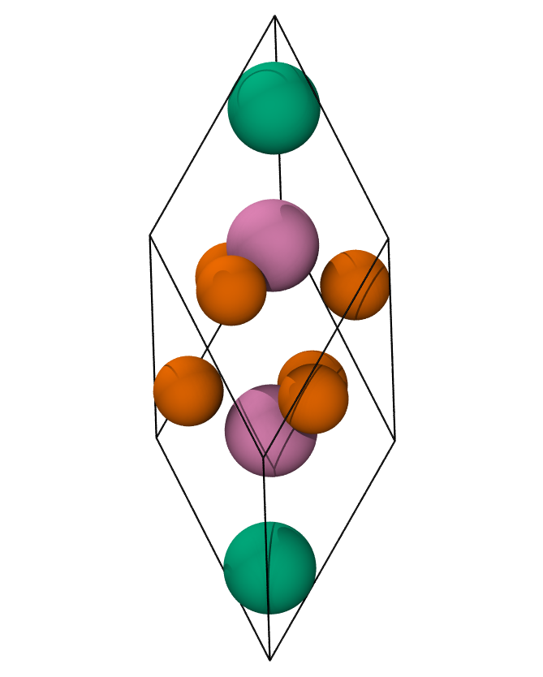
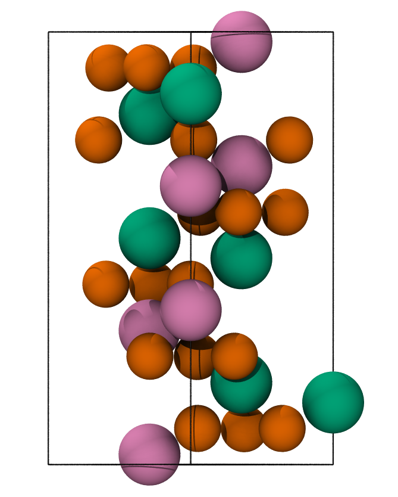
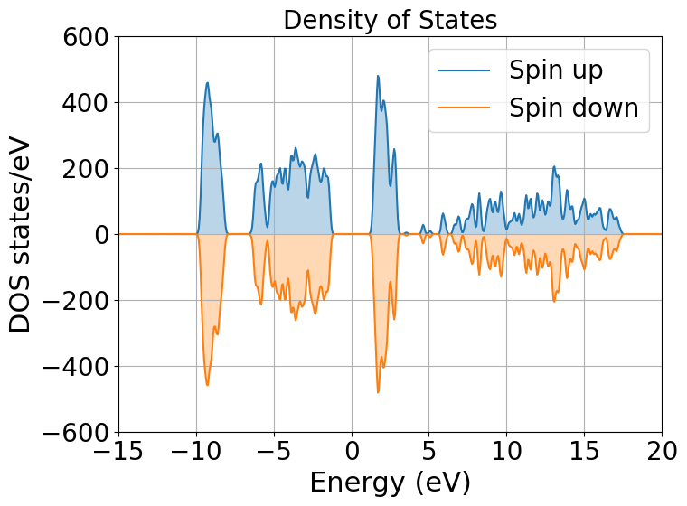
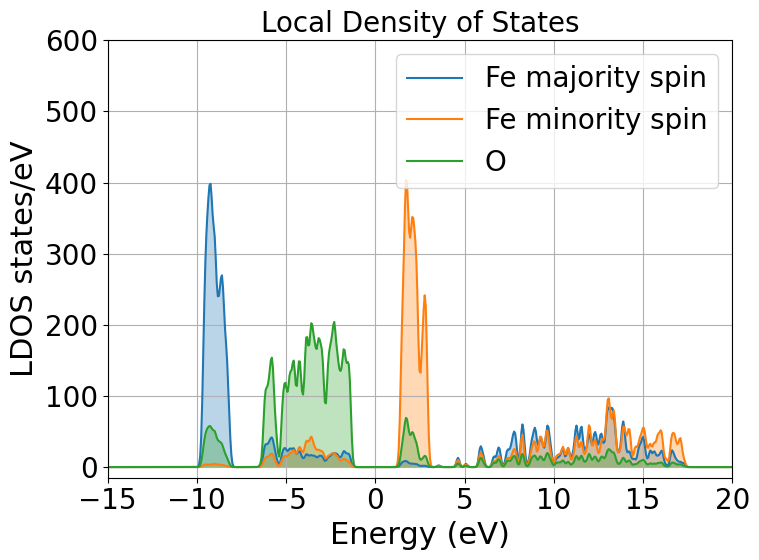
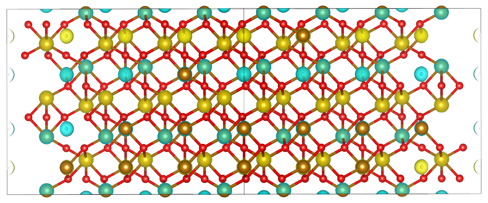

=================================================================================================================
Tutorial 9: DFT+\ :math:`U` on strongly correlated magnetic materials: A case study on antiferromagnetic Hematite
=================================================================================================================

:Author: Davide Sarpa
:Date:   July/Aug 2023 (revised June 2024)

.. role:: raw-latex(raw)
   :format: latex

Introduction
============

The goal of the tutorial is to provide a working example on how it is possible to model strongly correlated magnetic materials applying DFT+\ :math:`U` methods [Anisimov1991]_ [Anisimov1997]_ [Dudarev1998]_. We will be working
with hematite as an example of such materials.

Hematite
--------

Hematite is a blood-red iron oxide with formula :math:`\alpha-\text{Fe}_2\text{O}_3` with 
a melting point of :math:`1350` °C.
It belongs to the hexagonal crystal family, 
in particular, it is a Ditrigonal scalenohedral with a 
:math:`R\bar{3}C` space group (167), sharing the same structure as corundum. 
The lattice parameters :math:`a,b,c` are :math:`a=b=5.0356` Å and :math:`c=13.7489` Å with 6 formula units per cell 
with a band gap of :math:`1.9-2.2` eV. 
Its structure is an hpc anion stacking of :math:`\text{O}^{2-}` along the [001] direction 
with :math:`\text{Fe}^{3+}` occupying :math:`2/3` of the interstitial octahedrical positions [Cornell2003]_.
Below the Néel temperature (:math:`T_N = 963 K`), :math:`Fe_2O_3` 
is antiferromagnetic with weak ferromagnetism. 
The high-spin :math:`d^5` :math:`\text{Fe}^{3+}` cations within one bilayer in the (0001) planes are ferromagnetically coupled to each other 
while antiferromagnetically coupled to the adjacent Fe bilayers [Parkinson2016]_. The magnetic moment is determined to be :math:`4.6` :math:`\mu_{B}`  per atom.
The top of the valence band is dominated by oxygen p states,while the bottom of the conduction band is dominated by Fe d minority spin states.
Hematite is generally considered to be a charge transfer insulator rather than a Mott-Hubbard insulator [Naveas2023]_ [Huang2016]_ [Si2020]_.

Magnetism
---------

The weak ferromagnetism is due to spin-canting which is a relativistic effect. 
Luckily for us it is possible to obtain Hematite in an antiferromagnetic state with magnetic moments close to 
the experimental values by properly setting up the simulation without the need to include relativistic effects explicitly.

If we consider the primitive hematite cell along the Z axis there are 3 possible different antiferromagnetic states

* +-+- (up-down-up-down)
* ++-\- (up-up-down-down)
* +-\-+ (up-down-down-up)

Out of all these states the last one (+-\-+) is the ground state, we would like to be able to force our system to end up
in the ground state.

|pic1| |pic2|

   
Fig.1: Primitive rhombohedral cell (left), Conventional hexagonal cell (right). Fe atoms with spin up and down are in green and pink, respectively. O atoms are in orange

Magnetic systems are challenging to model due to the existence of very many different local minima which, in most cases, are very close in energy.
Forcing the system into a specific state may not be easy, but there are methods that can help us achieve what we want. 

DFT+\ :math:`U`
---------------
The problem of DFT to describe correlated systems can be attributed to the tendency of xc functionals to over-delocalize valence electrons and to over-stabilize metallic ground states,
this prevents materials like Hematite to be described by DFT. LDA and GGA both predict hematite to be a metallic system and they also underestimate local magnetic moments.
The reason behind this delocalization is rooted to the inability of the approximated xc to completely cancel out the electronic self-interaction contained in the Hartree term.
The main advantage of the DFT+\ :math:`U` method is that it is within the realm of DFT, thus does not require significant effort to be implemented in the existing DFT codes and its computational cost is only slightly higher than that of normal DFT computations.

DFT+U treats the d and f orbitals as localised while keep the rest at the delocalised LDA/GGA level. In order to do that it projects the bands into localised orbitals and compute a new potential.
The DFT+U method can be used to penalise the non-integer occupancy of these orbitals, tending to fill states with occupancy greater than 0.5 and empty states with occupancy less than 0.5.

.. math::

   \hat{V}^{(\sigma)}_{DFT+U} = \sum_{I}  U^{(I)}\lvert \varphi_m^{(I)} \rangle (\frac{1}{2} \delta_{m m'} - n^{(I) (\sigma)}_{m m'})  \langle\varphi_{m'}^{(I)} \rvert

The :math:`U` and :math:`J` values are screened Coloumb and Exchange terms which are system and implementation dependent. In general, you are not able to plug and play
an :math:`U` or :math:`J` value from the literature. What is usually done it's empirically testing different values (run multiple calculations with different combination of :math:`U` and :math:`J`) or
most software (including ONETEP) have a linear response theory implementation to calculate the parameters from first principles [O-Regan2010]_ [O-Regan2012]_ [Cococcioni2005]_. 

Setting up the calculations
===========================

Now we start with the actual tutorial, we will setup a bulk hematite simulation where we 
apply a DFT+U correction on the d orbitals of the iron atom. We also have to label atoms based on their spin
which allow us to assign different parameters for spin down and spin up Fe atoms. This will help us
achieve the AFM state we are looking for. We will see what we should look out in an output and what are 
the interesting properties for this material.

You will see that the cell and atoms we are using are neither from a primitive or a conventional cell, It is a  4x4x1 supercell generated from the conventional cell.
Such a big cell is necessary to accomodate NGWFs with 11 bohr radius.

Tutorial files
--------------

ONETEP requires different files to work properly.

1. A .dat file which contains all the information about your sytem (positions and cell) and the simulations parameters 
2. Pseudopotentials files, we will be using on the fly generated by CASTEP, but you could use your favourites.

All the files needed for the simulation can be downloaded from

- :download:`Fe_NCP19_PBE_OTF.usp <_static/tutorial_9/Fe_NCP19_PBE_OTF.usp>` 
- :download:`O_NCP19_PBE_OTF.usp <_static/tutorial_9/O_NCP19_PBE_OTF.usp>`
- :download:`hematite.out <_static/tutorial_9/hematite.out>`
- :download:`hematite.dat <_static/tutorial_9/hematite.dat>`

**Input File**

The first two blocks are the cell and atoms positions.
You might see that iron atoms are labelled Fe1 or Fe2 depending if they will be treated as spin up atoms or spin down atoms.

The third block is 

.. code-block:: none

      %BLOCK SPECIES
        Fe1 Fe 26 13 11.000000
        Fe2 Fe 26 13 11.000000
        O O 8 4 11.000000
      %ENDBLOCK SPECIES

This block tells us which atom type we should assing to Fe1, Fe2, and O, their atomic number and how many NGWFS we should use for each atom type as well as their radius.
For strongly correlated systems NGWFs radius of 11.00 bohr or more is suggested.
The next block is 

.. code-block:: none

   %BLOCK SPECIES_ATOMIC_SET
     Fe1 "SOLVE conf=3s2 3p6 3d5 4s0 4p0 SPIN=+5 CHARGE=0"
     Fe2 "SOLVE conf=3s2 3p6 3d5 4s0 4p0 SPIN=-5 CHARGE=0"
     O  "SOLVE INIT SPIN=0 CHARGE=-1"
   %ENDBLOCK SPECIES_ATOMIC_SET

This block setup the initial electronic configurations for the atoms. Fe1 and Fe2 atoms will a spin of + or - 5. 
The atomic solver generates the first guess for the density kernel for the first scf iteration, it does it by calculating the atomic density.

The next block is the Hubbard block where we setup the DFT+U parameters

.. code-block:: none

   %block hubbard
     Fe1 2 6.0 0.0 -10.0 0.00 0.0
     Fe2 2 6.0 0.0 -10.0 0.00 0.0
   %endblock hubbard

In this block we setup on the d (l=2) orbitals a U value of 6 the rest are the default parameters.

The rest of the blocks are to tell ONETEP for which atom types it has to compute the ldos and dos. Related to this functionality we also have to paratemers called dos_smear and pdos_max_l. The First
relates to the gaussian smearing applied to the dos and the max l quantum number to compute the pdos for. 

The rest of the parameters are self-explanatory with some exception such as maxit_palser_mano and maxit_hotelling which are related to the diagonalisation library.
If you require more explanation you can refer to the ONETEP keyword database.

**Pseudopotentials**

It is important to know is that the number of NGWFs depends on your Pseudopotentials.
If you use your own be sure to modify them.
A quick note on the value of the kinetic energy cutoff. The very high value is due to the Fe pseudopotential which include 3s and 3p semi-core states.

Evaluating the outputs
======================
ONETEP will generate many files based on we configured the calculations, but for this
tutorial we will be focusing on few ones.

* .out: the main output file
* DOS.txt: Density of states file 
* LDOS.txt: Local density of states file 
* PDOS.txt: Partial density of states file 
* spindensity.cube: Cube file necessary to visualise the spin density

What to look for in the main output file
----------------------------------------

First thing is to check is the whether the atoms are in the configuration you wanted to (in our case a :math:`\text{Fe}^{3+}` with spin UP or DOWN).
This can be seen by looking for this block for each atom (shown here the down Fe atom)

.. code-block:: none

   Orbitals (num,spin,occ):  5  1     1.00 3.00 0.00 0.00 0.00
   Orbitals   (num,spin,l):  5  1        0    1    2    0    1
   Orbitals (num,spin,occ):  5  2     1.00 3.00 5.00 0.00 0.00
   Orbitals   (num,spin,l):  5  2        0    1    2    0    1

As you can see it was properly set as we have the occupancies as we wanted them to be 

The second step is, as explained in the DFT+U part, the occupancies for the majority spin (either UP or DOWN for different Fe atoms)
has to be :math:`> 0.5` while :math:`< 0.5` for the minority spin. This is very important to allow DFT+U to do its job and it can be checked in the following table by looking at the diagonal elements.

.. code-block:: none

   ################################################################################
   DFT+U information on atom      1 of Hubbard species Fe1 
   ################################################################################
   Occupancy matrix of Hubbard site      1 and spin      1 is 
     m_l =   -2          -1           0           1           2
     0.98760734  0.00754848 -0.00233330  0.00015001 -0.00147641
     0.00754493  0.99044110  0.00093484  0.00063070  0.00195361
    -0.00233979  0.00093793  0.99053553  0.00062471  0.00142290
     0.00014994  0.00063069  0.00062302  0.99083622 -0.00700465
    -0.00147664  0.00195472  0.00141925 -0.00700844  0.98744366
   ################################################################################
   Occupancy matrix of Hubbard site      1 and spin      2 is 
     m_l =   -2          -1           0           1           2
     0.19734987 -0.07593555 -0.02935837 -0.01152995 -0.01749110
    -0.07589974  0.26431985  0.00033807  0.00686795 -0.01256107
    -0.02943958  0.00033830  0.10618329  0.00064404  0.01701648
    -0.01152456  0.00686813  0.00063868  0.25542523  0.07653629
    -0.01749366 -0.01256804  0.01696807  0.07657798  0.17892533
   ################################################################################
   Total occupancy of Hubbard site      1 is         5.94906741 e
   Local magnetic moment of Hubbard site      1 is   3.94466029 mu_B
   DFT+U energy of Hubbard site      1 is            0.08933769 Ha
   ################################################################################

Another important thing to check are the bands occupancies. Hematite is a semiconductor
with a 2 eV band gap, we would then expect to have fully occupied bands and unoccupied virtual bands.
If we were to treat it as a metal we could expect fractional occupancies occurring, but that would be physically wrong for our system.

If you look at the band occupancies for both spin up and down, you can see that we indeed obtain fully occupied bands and unoccupied bands. 
This reassure us that the structure we obtained is chemically and physically sensible.

.. code-block:: none

                              Spin 1           |                 Spin 2           |
        Orb |    H-eigenvalues     Occupancies |    H-eigenvalues     Occupancies |
          1 |    -2.7569116405    1.0000000000 |    -2.7569258300    1.0000000000 | 
                             ------                             ------
       2396 |     0.5911355692    1.0000000000 |     0.5911388571    1.0000000000 | 
       2397 |     0.5931137905    1.0000000000 |     0.5931136453    1.0000000000 | 
       2398 |     0.5931148723    1.0000000000 |     0.5931148136    1.0000000000 | 
       2399 |     0.5936028814    1.0000000000 |     0.5936016525    1.0000000000 | 
       2400 |     0.5936039546    1.0000000000 |     0.5936026510    1.0000000000 | 
                    - Gap at zero temperature - |     - Gap at zero temperature -
                     Finite temp. Fermi level   |      Finite temp. Fermi level  
       2401 |     0.6272424125    0.0000000000 |     0.6272633138    0.0000000000 | 
       2402 |     0.6297211476    0.0000000000 |     0.6297567335    0.0000000000 | 
       2403 |     0.6297236475    0.0000000000 |     0.6297598360    0.0000000000 | 
       2404 |     0.6302246277    0.0000000000 |     0.6302507711    0.0000000000 | 
       2405 |     0.6302330454    0.0000000000 |     0.6302577875    0.0000000000 | 
                             ------                             ------
       3648 |     1.1980169016    0.0000000000 |     1.1980204435    0.0000000000 |

And as last we should also check that we obtain a band gap and its value is close to experiment.
This can be seen from the output by looking for these lines. 

Why do we get two band gaps? Because we are studying a magnetic system, we get a band gap for each spin channel and for an AFM material
the bandgap should be the same (numerical errors aside).

.. code-block:: none

   HOMO-LUMO gap:       0.101182637 Eh
   HOMO-LUMO gap:       0.101174972 Eh

DOS and PDOS
------------

Next step is to plot the density of states. It will tell us the distribution of electrons and states in our system

We indeed obtain a gap between the states but it does not tell us much more. To obtain more information we will be plotting the local density of states (LDOS)
and the partial density of states (PDOS).

|ldos| |pdos|

.. |pdos| image:: _static/tutorial_9/pdos.png
   :width: 49%

From the local density of states we can immediately notice that the lowest lying bands in the plot are mostly made of Fe majority spin channel states but,
this is very important, the top of the valence band is made mostly by O p states. The bottom of the conduction band is made of Fe minority spin states.
This allow us to classify hematite as a charge transfer insulator between the oxygen and the iron atoms. What if we would like to know which atomic orbitals
contribute the most in this charge transfering? We need to plot the PDOS.

It will project the bands into the atomic components, in this way, as you can see in the graph the top of the valence band
is dominated by O 2p states while the bottom of the conduction band by Fe minority spin 3d states. 

Mulliken population analysis
----------------------------

The Mulliken population analysis is a very good tool to understand if our system is behaving correctly.
In an AFM material the total spin should be 0 and the local spin should be the same for the same atoms. In this case we have two different types
The spin up and down Fe atoms. The absolute value of the local spin should be the same with just different signs.

The material is also charge neutral and we would expect that the similar atoms should carry similar charges.

+------------+-----------+----------+------------+------------+
|   Species  |    Ion    |   Total  | Charge (e) | Spin (hbar)|
+============+===========+==========+============+============+
| 0          | 1         | 6.923    |  -0.923    | 0.00       |
+------------+-----------+----------+------------+------------+
| 0          | 2         | 6.923    |  -0.923    | -0.00      |
+------------+-----------+----------+------------+------------+
| 0          | 3         | 6.922    |  -0.922    | -0.00      |
+------------+-----------+----------+------------+------------+
| 0          | 4         | 6.922    |  -0.922    | -0.00      |
+------------+-----------+----------+------------+------------+
| 0          | 5         | 6.922    |  -0.922    | 0.00       |
+------------+-----------+----------+------------+------------+
| 0          | 6         | 6.922    |  -0.922    | 0.00       |
+------------+-----------+----------+------------+------------+
| Fe         | 7         | 14.617   |  1.383     | 2.21       |
+------------+-----------+----------+------------+------------+
| Fe         | 8         | 14.616   |  1.384     | 2.21       |
+------------+-----------+----------+------------+------------+
| Fe         | 9         | 14.617   |  1.383     | -2.21      |
+------------+-----------+----------+------------+------------+
| Fe         | 10        | 14.617   |  1.383     | -2.21      |
+------------+-----------+----------+------------+------------+

As you can see from this snapshot we do indeed obtain the same charge and same spin for all similar atoms as 
we would expect. 

Spin Density
------------
Now it is time to visualise the spin density which is the total electron density of electrons of one spin minus 
the total electron density of the electrons of the other spin. 
We would like to visualise it to know if we obtained the afm state we wanted, the up-down-down-up configuration.

You can directly open and visualise The .cube generated at the end of the calculations with VESTA, VMD or lots of other softwares.

   Fig.2: Hematite spin density, blu spheres refers to atom with up spin and yellow to down spin

You can see from the picture that we did get the AFM states with +--+ configuration as we wanted.

What to do next
---------------
The tutorial is now complete, but you could still move forward. What can you do next?
ONETEP outputs many more information than the one showed you here.
You can plot

* The electrostatic potential
* The orbitals
* The electron density

You can then relax the structure and recompute the properties to see what changed and how.
We have chosen to use U=6, but you could try different U values and see how it affects the system.

References
----------

.. [Cornell2003]  R.M.Cornell et al, in The Iron Oxides, John Wiley & Sons, Ltd, 2003, pp. 9-38.
.. [Parkinson2016]  G.S.Parkinson, Surface Science Reports, vol. 71, no. 1, pp. 272–365, 1 Mar. 1, 2016. 

.. [Naveas2023] Naveas M. et al, iScience 26, 106033, February 17, 2023.

.. [Huang2016]  Huang X. et al,  J.Phys.Chem C 2016,  120, 4919-4930.

.. [Si2020] Si et al, J. Chem. Phys. 152, 024706 (2020).

.. [O-Regan2012] D.D.O’Regan, N. D. M. Hine, M. C. Payne and A. A. Mostofi, Phys. Rev. B 85, 085107 (2012).

.. [Cococcioni2005] M.Cococcioni and S. de Gironcoli, Phys. Rev. B 71, 035105 (2005).

.. [O-Regan2010] D.D.O’Regan, N. D. M. Hine, M. C. Payne and A. A. Mostofi, Phys. Rev. B 82, 081102 (2010).

.. [Anisimov1991] J.Z.V.I. Anisimov and O. K. Andersen, Phys. Rev. B 44, 943 (1991).

.. [Anisimov1997] V.I. Anisimov, F. Aryasetiawan, and A. I. Liechtenstein, J. Phys.: Condens. Matter 9, 767 (1997).

.. [Dudarev1998] S.L. Dudarev, Phys. Rev. B 57, 3 (1998).
