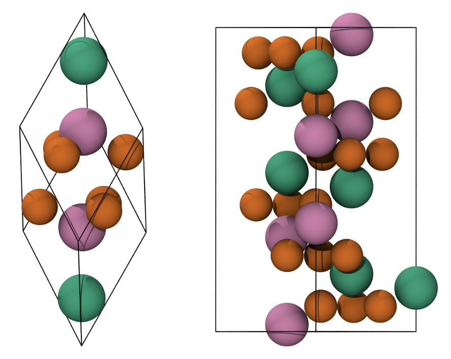
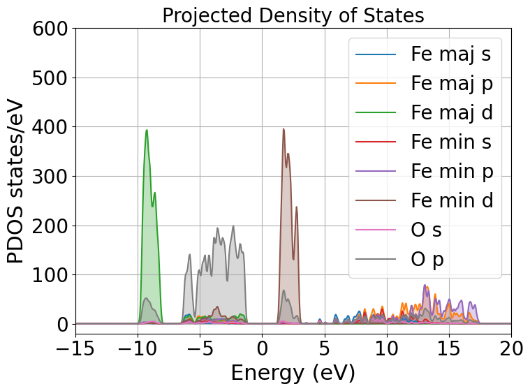

=================================================================================================================
Tutorial 9: DFT+\ :math:`U` on strongly correlated magnetic materials: A case study on antiferromagnetic Hematite
=================================================================================================================

:Author: Davide Sarpa
:Date:   July/Aug 2023 (revised June 2024)

.. role:: raw-latex(raw)
   :format: latex

Introduction
============

The goal of the tutorial is to provide a working example on how it is possible to model strongly correlated magnetic materials applying the DFT+\ :math:`U` method [Anisimov1991]_ [Anisimov1997]_ [Dudarev1998]_. We will be working
with hematite as an example of such materials.

Hematite
--------

Hematite is a blood-red iron oxide with formula :math:`\alpha`-:math:`\text{Fe}_2\text{O}_3` with 
a melting point of :math:`1350°\text{C}`.
It belongs to the hexagonal crystal family, 
in particular, it is a ditrigonal scalenohedral with a 
:math:`R\bar{3}C` space group (167), sharing the same structure as corundum. 
The lattice parameters :math:`a,b,c` are :math:`a=b=5.0356` Å and :math:`c=13.7489` Å with 6 formula units per cell 
with a band gap of :math:`1.9-2.2` eV. 
Its structure is an hpc anion stacking of :math:`\text{O}^{2-}` along the [001] direction 
with :math:`\text{Fe}^{3+}` occupying :math:`2/3` of the interstitial octahedrical positions [Cornell2003]_.
Below the Néel temperature (:math:`T_N = 963 K`), :math:`\text{Fe}_2\text{O}_3` 
is antiferromagnetic with weak ferromagnetism. 
The high-spin :math:`d^5` :math:`\text{Fe}^{3+}` cations within one bilayer in the (0001) planes are ferromagnetically coupled to each other 
while antiferromagnetically coupled to the adjacent Fe bilayers [Parkinson2016]_. The magnetic moment is determined to be :math:`4.6` :math:`\mu_{\text{B}}`  per atom.
The top of the valence band is dominated by oxygen :math:`p` states,while the bottom of the conduction band is dominated by Fe :math:`d` minority spin states.
Hematite is generally considered to be a charge transfer insulator rather than a Mott-Hubbard insulator [Naveas2023]_ [Huang2016]_ [Si2020]_.

Magnetism
---------

The weak ferromagnetism is due to spin-canting which is a relativistic effect. 
Luckily for us it is possible to obtain hematite in an antiferromagnetic state with magnetic moments close to 
the experimental values by properly setting up the calculation without the need to include relativistic effects explicitly.

If we consider the primitive hematite cell along the Z axis, there are 3 possible different antiferromagnetic states

* :code:`+-+-` (up-down-up-down),
* :code:`++-\-` (up-up-down-down),
* :code:`+-\-+` (up-down-down-up).

Out of all these states the last one (:code:`+-\-+`) is the ground state, we would like to be able to force our system to end up
in the ground state.

.. _Figure fig:T9_1:

   Primitive rhombohedral cell (left), conventional hexagonal cell (right). Fe atoms with spin up and down are in green and pink, respectively. O atoms are in orange.

Magnetic systems are challenging to model due to the existence of very many different local minima which, in most cases, are very close in energy.
Forcing the system into a specific state may not be easy, but there are methods that can help us achieve what we want. 

DFT+\ :math:`U`
---------------
The problem of DFT to describe correlated systems can be attributed to the tendency of xc functionals to over-delocalize valence electrons and to over-stabilize metallic ground states,
this prevents materials like hematite from being described by DFT. LDA and GGA both predict hematite to be a metallic system, they also underestimate local magnetic moments.
The reason behind this delocalisation is rooted in the inability of the approximated xc to completely cancel out the electronic self-interaction contained in the Hartree term.
The main advantage of the DFT+\ :math:`U` method is that it is within the realm of DFT, thus it does not require significant effort to be implemented in existing DFT codes and its computational cost is only slightly higher than that of normal DFT computations.

The DFT+\ :math:`U` method selectively localizes specific orbital sets, typically :math:`d` and :math:`f` orbitals, while maintaining the delocalized nature of other orbitals at the LDA/GGA level. 
This is achieved by projecting the electronic bands onto a localized basis and calculating a modified potential.
The DFT+\ :math:`U` method can be used to penalise the non-integer occupancy of these orbitals, tending to fill states with occupancy greater than 0.5 and to empty states with occupancy less than 0.5.

.. math::

   \hat{V}^{(\sigma)}_{DFT+U} = \sum_{I}  U^{(I)}\lvert \varphi_m^{(I)} \rangle (\frac{1}{2} \delta_{m m'} - n^{(I) (\sigma)}_{m m'})  \langle\varphi_{m'}^{(I)} \rvert.

The :math:`U` and :math:`J` values are screened Coloumb and exchange terms, which are system and implementation-dependent. In general, you are not able to plug and play
a :math:`U` or :math:`J` value from the literature. What is usually done is empirically testing different values (run multiple calculations with different combination of :math:`U` and :math:`J`), or
most software (including ONETEP) have a linear response theory implementation to calculate the parameters from first principles [O-Regan2010]_ [O-Regan2012]_ [Cococcioni2005]_. 

Setting up the calculations
===========================

We will configure a bulk hematite calculation implementing a DFT+\ :math:`U` correction specifically for the Fe :math:`3d` orbitals. We apply distinct labels to Fe atoms, 
enabling us to assign different parameters to spin-up and spin-down Fe atoms. This labeling strategy facilitates the achievement of the desired antiferromagnetic (AFM) state in hematite.
You will see that the cell and atoms we are using are neither from a primitive or a conventional cell, It is a  4x4x1 supercell generated from the conventional cell.
Such a big cell is necessary to accomodate NGWFs with a radius of 11 Bohr.

Tutorial files
--------------

ONETEP requires different files to work properly.

1. A :code:`.dat` file which contains all the information about your sytem and the simulations parameters;
2. pseudopotentials files, we will be using on the fly generated by CASTEP, but you could use your favourites.

All the files needed for the simulation can be downloaded from

- :download:`Fe_NCP19_PBE_OTF.usp <_static/tutorial_9/Fe_NCP19_PBE_OTF.usp>`, 
- :download:`O_NCP19_PBE_OTF.usp <_static/tutorial_9/O_NCP19_PBE_OTF.usp>`,
- :download:`hematite.out <_static/tutorial_9/hematite.out>`,
- :download:`hematite.dat <_static/tutorial_9/hematite.dat>`.

**Input File**

The first two blocks are the cell and atomic positions.
You might see that iron atoms are labelled :code:`Fe1` or :code:`Fe2`, depending on whether they will be treated as spin up atoms or spin down atoms.

The third block is: 

.. code-block:: none

      %BLOCK SPECIES
        Fe1 Fe 26 13 11.000000
        Fe2 Fe 26 13 11.000000
        O O 8 4 11.000000
      %ENDBLOCK SPECIES

The block defines the elements and enables the user to specify labels (such as :code:`Fe1`, :code:`Fe2` and :code:`O`), atomic numbers, 
and the number of NGWFs  to be used for each atom type inside the calculation. 
Additionally, it allows the user to set the radius for these NGWFs.
For strongly correlated systems NGWFs radius of 11.0 Bohr or more is suggested.
The next block is: 

.. code-block:: none

   %BLOCK SPECIES_ATOMIC_SET
     Fe1 "SOLVE conf=3s2 3p6 3d5 4s0 4p0 SPIN=+5 CHARGE=0"
     Fe2 "SOLVE conf=3s2 3p6 3d5 4s0 4p0 SPIN=-5 CHARGE=0"
     O  "SOLVE INIT SPIN=0 CHARGE=-1"
   %ENDBLOCK SPECIES_ATOMIC_SET

This block sets up the initial electronic configurations for the atoms. :code:`Fe1` or :code:`Fe2` atoms will have a spin of +5 or -5, respectively. 
The atomic solver generates the first guess for the density kernel for the first SCF iteration.

The next block is the Hubbard block where we set up the DFT+\ :math:`U` parameters:

.. code-block:: none

   %block hubbard
     Fe1 2 6.0 0.0 -10.0 0.00 0.0
     Fe2 2 6.0 0.0 -10.0 0.00 0.0
   %endblock hubbard

We assign a :math:`U` value of 6 to the :math:`d` orbitals (:math:`l=2`) in this block. For all other columns, we use default parameters.

The remaining blocks instruct ONETEP which atom types to use for calculating the local density of states (LDOS) and density of states (DOS). 
Two relevant parameters are also important:

1. :code:`dos_smear`: Controls the Gaussian smearing applied to the DOS;
2. :code:`pdos_max_l`: Specifies the maximum angular momentum quantum number (:math:`l`) for computing the projected DOS.

Most other parameters are self-explanatory, with a few exceptions:

- :code:`maxit_palser_mano`
- :code:`maxit_hotelling`

These are associated with the diagonalization library and calculation of the inverse of the overlap matrix.
For more detailed explanations of any parameters, consult the ONETEP keyword database.

**Pseudopotentials**

The number of NGWFs is determined by your choice of pseudopotentials. If you're using different pseudopotentials from the one provided here, make sure to adjust the number of NGWFs accordingly.
Regarding the kinetic energy cutoff: The unusually high value is necessary due to the Fe pseudopotential. This particular pseudopotential includes :math:`3s` and :math:`3p` semi-core states, which require a higher cutoff for accurate representation.

Evaluating the outputs
======================
ONETEP will generate many files based on how we configured the calculations, but for this
tutorial we will be focusing on only a few.

* :code:`.out`: the main output file,
* :code:`DOS.txt`: density of states file,
* :code:`LDOS.txt`: local density of states file, 
* :code:`PDOS.txt`: projected density of states file, 
* :code:`spindensity.cube`: cube file necessary to visualise the spin density.

What to look for in the main output file
----------------------------------------

The first thing is to check is the whether the atoms are in the configuration we wanted (in our case a :math:`\text{Fe}^{3+}` with spin up or down).
This can be seen by looking at this block for each atom (shown here the down Fe atom)

.. code-block:: none

   Orbitals (num,spin,occ):  5  1     1.00 3.00 0.00 0.00 0.00
   Orbitals   (num,spin,l):  5  1        0    1    2    0    1
   Orbitals (num,spin,occ):  5  2     1.00 3.00 5.00 0.00 0.00
   Orbitals   (num,spin,l):  5  2        0    1    2    0    1

The first number refers to the total number of orbitals (:math:`3s`, :math:`3p`, :math:`3d`, :math:`4s`, :math:`4p` as defined previosly), the spin channel either 1 or 2 and the orbital occupancies.
In this case we have 1 spin up and 1 spin down electron in the :math:`3s` orbital, 3 up and 3 down electrons in the :math:`3p` orbitals and 5 spin down electrons in the :math:`3d` orbitals
the :math:`4s` and :math:`4p` are empty.

The second step is, as explained in the DFT+\ :math:`U` part, the occupancies for the majority spin channel (either up or down for different Fe atoms)
has to be :math:`> 0.5` while :math:`< 0.5` for the minority spin channel. This is very important to allow DFT+\ :math:`U` to do its job and it can be checked in the following table by looking at the diagonal elements.

.. code-block:: none

   ################################################################################
   DFT+U information on atom      1 of Hubbard species Fe1 
   ################################################################################
   Occupancy matrix of Hubbard site      1 and spin      1 is 
     m_l =   -2          -1           0           1           2
     0.98760734  0.00754848 -0.00233330  0.00015001 -0.00147641
     0.00754493  0.99044110  0.00093484  0.00063070  0.00195361
    -0.00233979  0.00093793  0.99053553  0.00062471  0.00142290
     0.00014994  0.00063069  0.00062302  0.99083622 -0.00700465
    -0.00147664  0.00195472  0.00141925 -0.00700844  0.98744366
   ################################################################################
   Occupancy matrix of Hubbard site      1 and spin      2 is 
     m_l =   -2          -1           0           1           2
     0.19734987 -0.07593555 -0.02935837 -0.01152995 -0.01749110
    -0.07589974  0.26431985  0.00033807  0.00686795 -0.01256107
    -0.02943958  0.00033830  0.10618329  0.00064404  0.01701648
    -0.01152456  0.00686813  0.00063868  0.25542523  0.07653629
    -0.01749366 -0.01256804  0.01696807  0.07657798  0.17892533
   ################################################################################
   Total occupancy of Hubbard site      1 is         5.94906741 e
   Local magnetic moment of Hubbard site      1 is   3.94466029 mu_B
   DFT+U energy of Hubbard site      1 is            0.08933769 Ha
   ################################################################################

Another important thing to check are the bands' occupancies. Hematite is a semiconductor
with a 2 eV band gap, we would then expect to have fully occupied bands and unoccupied virtual bands.
If we were to treat it as a metal we could expect fractional occupancies occurring, but that would be physically wrong for our system.

If you look at the band occupancies for both spin up and down channel, you can see that we indeed obtain fully occupied bands and unoccupied bands. 
This reassure us that the structure we obtained is chemically and physically sensible.

.. code-block:: none

                              Spin 1           |                 Spin 2           |
        Orb |    H-eigenvalues     Occupancies |    H-eigenvalues     Occupancies |
          1 |    -2.7569116405    1.0000000000 |    -2.7569258300    1.0000000000 | 
                             ------                             ------
       2396 |     0.5911355692    1.0000000000 |     0.5911388571    1.0000000000 | 
       2397 |     0.5931137905    1.0000000000 |     0.5931136453    1.0000000000 | 
       2398 |     0.5931148723    1.0000000000 |     0.5931148136    1.0000000000 | 
       2399 |     0.5936028814    1.0000000000 |     0.5936016525    1.0000000000 | 
       2400 |     0.5936039546    1.0000000000 |     0.5936026510    1.0000000000 | 
                   - Gap at zero temperature - |     - Gap at zero temperature -
                    Finite temp. Fermi level   |      Finite temp. Fermi level  
       2401 |     0.6272424125    0.0000000000 |     0.6272633138    0.0000000000 | 
       2402 |     0.6297211476    0.0000000000 |     0.6297567335    0.0000000000 | 
       2403 |     0.6297236475    0.0000000000 |     0.6297598360    0.0000000000 | 
       2404 |     0.6302246277    0.0000000000 |     0.6302507711    0.0000000000 | 
       2405 |     0.6302330454    0.0000000000 |     0.6302577875    0.0000000000 | 
                             ------                             ------
       3648 |     1.1980169016    0.0000000000 |     1.1980204435    0.0000000000 |

Lastly we should also check that we obtain a band gap and its value is close to experiment.
This can be seen from the output by looking for these lines. 

Why do we get two band gaps? Because we are studying a magnetic system, we get a band gap for each spin channel and for an AFM material
the bandgap should be the same (numerical errors aside).

.. code-block:: none

   HOMO-LUMO gap:       0.101182637 Eh
   HOMO-LUMO gap:       0.101174972 Eh

DOS and PDOS
------------

Next step is to plot the density of states. It will tell us the distribution of electrons and states in our system

We indeed obtain a gap between the states but it does not tell us much more. To obtain more information we will be plotting the local density of states (LDOS)
and the projected density of states (PDOS).

|ldos| |pdos|

From the local density of states we can immediately notice that the lowest lying bands in the plot are mostly comprised of Fe majority spin channel states but,
this is very important, the top of the valence band is mostly composed of O :math:`p` states. The bottom of the conduction band is composed of Fe minority spin states.
This allow us to classify hematite as a charge transfer insulator between the O and the Fe atoms. What if we would like to know which atomic orbitals
contribute the most to this charge transfer, we need to plot the PDOS.

This will project the bands into the atomic components, in this way, as you can see in the plot the top of the valence band
is dominated by O :math:`2p` states while the bottom of the conduction band is dominated by Fe minority spin :math:`3d` states. 

Mulliken population analysis
----------------------------

Mulliken population analysis is a very good tool to understand if our system is behaving correctly.
In an AFM material the total spin should be 0 and the atomic spin should be the same for the same atoms. In this case we have two different types,
the spin up and down Fe atoms. The absolute value of the atomic spin should be the same only with different sign.

The material is also charge neutral and we would expect that similar atoms should carry similar charges.

.. table:: 
   :align: center

   +------------+-----------+----------+------------+------------+
   |   Species  |    Ion    |   Total  | Charge (e) | Spin (hbar)|
   +============+===========+==========+============+============+
   | O          | 1         | 6.923    |  -0.923    | 0.00       |
   +------------+-----------+----------+------------+------------+
   | O          | 2         | 6.923    |  -0.923    | -0.00      |
   +------------+-----------+----------+------------+------------+
   | O          | 3         | 6.922    |  -0.922    | -0.00      |
   +------------+-----------+----------+------------+------------+
   | O          | 4         | 6.922    |  -0.922    | -0.00      |
   +------------+-----------+----------+------------+------------+
   | O          | 5         | 6.922    |  -0.922    | 0.00       |
   +------------+-----------+----------+------------+------------+
   | O          | 6         | 6.922    |  -0.922    | 0.00       |
   +------------+-----------+----------+------------+------------+
   | Fe         | 7         | 14.617   |  1.383     | 2.21       |
   +------------+-----------+----------+------------+------------+
   | Fe         | 8         | 14.616   |  1.384     | 2.21       |
   +------------+-----------+----------+------------+------------+
   | Fe         | 9         | 14.617   |  1.383     | -2.21      |
   +------------+-----------+----------+------------+------------+
   | Fe         | 10        | 14.617   |  1.383     | -2.21      |
   +------------+-----------+----------+------------+------------+

As you can see from this snapshot, we do indeed obtain the same charge and same spin for all similar atoms as 
we would expect. 

Spin density
------------
Now it is time to visualise the spin density, which is the total electron density of electrons of one spin minus 
the total electron density of the electrons of the other spin. 
We would like to visualise it to know if we obtained the AFM state we wanted, the up-down-down-up configuration.

You can directly open and visualise the :code:`.cube` file generated at the end of the calculation with VESTA, VMD or other softwares.

.. figure:: _static/tutorial_9/hematite_spindensity.png
   :align: center
   :scale: 30%

   Hematite spin density, blu spheres refers to atom with up spin and yellow to down spin

You can see from the picture that we did get the AFM states with :code:`+-\-+` configuration as we wanted.

What to do next
---------------
The tutorial is now complete, but you could still move forward. What can you do next?
ONETEP outputs more information than what we covered so far.
You can plot:

* the electrostatic potential,
* the orbitals,
* the electronic density.

You can then relax the structure and recompute the properties to see what changed and how.
We have chosen to use :math:`U=6`, but you could try different :math:`U` values and see how that affects the system.

.. [Cornell2003]  R.M.Cornell et al, in The Iron Oxides, John Wiley & Sons, Ltd, 2003, pp. 9-38.
.. [Parkinson2016]  G.S.Parkinson, Surface Science Reports, vol. 71, no. 1, pp. 272–365, 1 Mar. 1, 2016. 

.. [Naveas2023] Naveas M. et al, iScience 26, 106033, February 17, 2023.

.. [Huang2016]  Huang X. et al,  J.Phys.Chem C 2016,  120, 4919-4930.

.. [Si2020] Si et al, J. Chem. Phys. 152, 024706 (2020).

.. [O-Regan2012] D.D.O’Regan, N. D. M. Hine, M. C. Payne and A. A. Mostofi, Phys. Rev. B 85, 085107 (2012).

.. [Cococcioni2005] M.Cococcioni and S. de Gironcoli, Phys. Rev. B 71, 035105 (2005).

.. [O-Regan2010] D.D.O’Regan, N. D. M. Hine, M. C. Payne and A. A. Mostofi, Phys. Rev. B 82, 081102 (2010).

.. [Anisimov1991] J.Z.V.I. Anisimov and O. K. Andersen, Phys. Rev. B 44, 943 (1991).

.. [Anisimov1997] V.I. Anisimov, F. Aryasetiawan, and A. I. Liechtenstein, J. Phys.: Condens. Matter 9, 767 (1997).

.. [Dudarev1998] S.L. Dudarev, Phys. Rev. B 57, 3 (1998).
